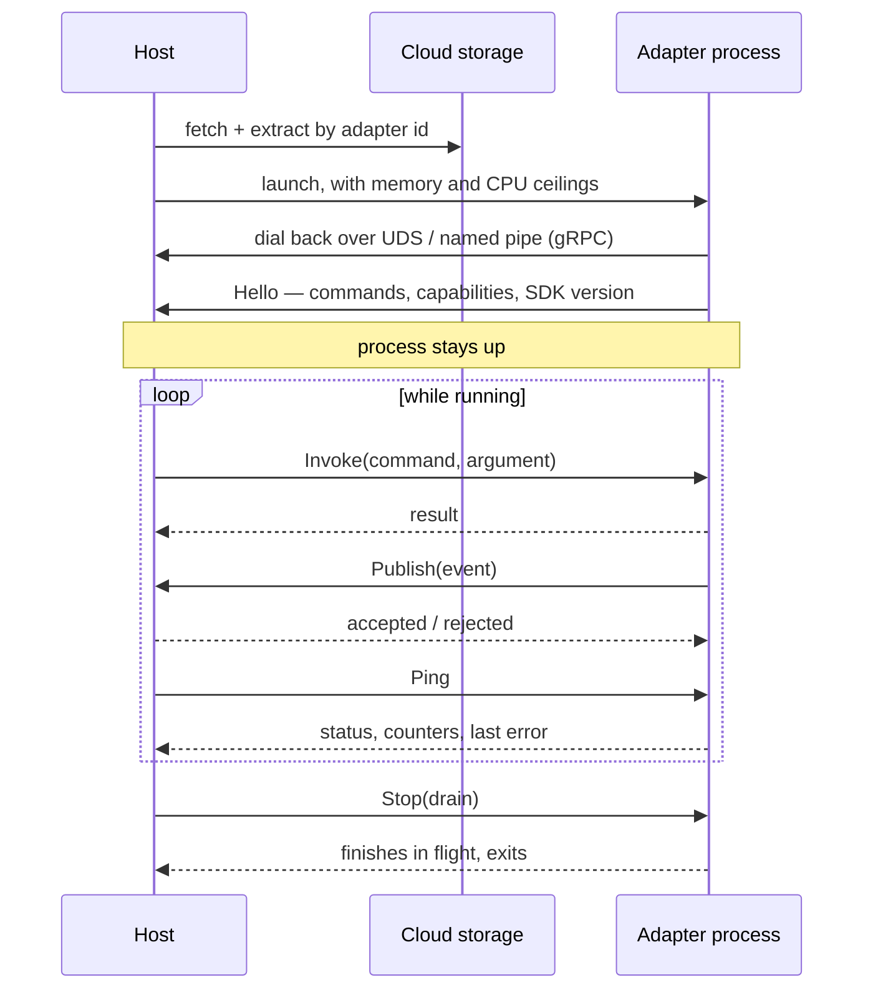
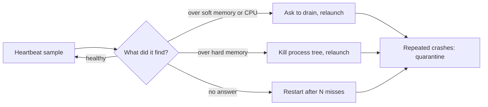

# SW.Serverless

[](https://github.com/simplify9/SW-Serverless/actions/workflows/nuget-publish.yml)
[](https://www.nuget.org/packages/SimplyWorks.Serverless)
[](https://www.nuget.org/packages/SimplyWorks.Serverless.Sdk)
[](LICENSE)

**SW.Serverless** is an open-source .NET framework for building and running serverless adapters and services. It provides a runtime environment for executing .NET applications as serverless functions with process isolation and communication through stdin/stdout.

## NuGet Packages

| Package | Version | Downloads |
| ------- | ------- | --------- |
| `SimplyWorks.Serverless` | [](https://www.nuget.org/packages/SimplyWorks.Serverless) | [](https://www.nuget.org/packages/SimplyWorks.Serverless) |
| `SimplyWorks.Serverless.Sdk` | [](https://www.nuget.org/packages/SimplyWorks.Serverless.Sdk) | [](https://www.nuget.org/packages/SimplyWorks.Serverless.Sdk) |

## What's Included

- **SW.Serverless**: Core serverless service library with dependency injection extensions for ASP.NET Core
- **SW.Serverless.Sdk**: SDK for developing serverless adapters with the `Runner` class and logging utilities
- **SW.Serverless.SampleWeb**: Example ASP.NET Core web application showing integration
- **SW.Serverless.Installer**: Command-line tool for packaging and deploying adapters to cloud storage

## Quick Start

### Install NuGet Packages

```bash
dotnet add package SimplyWorks.Serverless
dotnet add package SimplyWorks.Serverless.Sdk
```

### Add to ASP.NET Core

```csharp
// In Startup.cs or Program.cs
services.AddServerless();
```

### Create an Adapter

```csharp
using SW.Serverless.Sdk;

class Handler
{
    public async Task<string> ProcessData(string input)
    {
        // Your serverless logic here
        return $"Processed: {input}";
    }
}

class Program
{
    static async Task Main(string[] args) => await Runner.Run(new Handler());
}
```

## Resident Adapters

A classic adapter is launched per invocation and exits when it returns. A **resident** adapter is
launched once and stays running, so it can hold state — an open broker connection, a pooled HTTP/2
channel, a warm cache — and push work into the host as well as receive it.



The adapter dials **out** to the host over a Unix domain socket or a named pipe — nothing listens
on a TCP port, and the adapter needs no inbound reachability.

### Two directions

| | |
| --- | --- |
| **Host → adapter** | `InvokeAsync<T>("Command", argument)` — any public `Task`/`Task<T>` method on the handler, discovered by reflection. |
| **Adapter → host** | `context.PublishAsync(payload, dedupeKey, endpoint, …)` — the host persists, then answers accepted or rejected. The adapter acknowledges its source only after that. |

### Writing one

```csharp
using SW.Serverless.Sdk;
using SW.Serverless.Sdk.Resident;

class Handler : IResidentAdapter
{
    IAdapterContext _context;

    public Task StartAsync(IAdapterContext context, CancellationToken ct)
    {
        _context = context;                       // connect, subscribe, warm up
        return Task.CompletedTask;
    }

    public Task StopAsync(CancellationToken ct) => Task.CompletedTask;

    public Task<AdapterStatus> GetStatusAsync() =>
        Task.FromResult(new AdapterStatus { Connected = true, State = "Ready" });

    [AdapterCommand("What this command does.")]
    public Task<object> GetStats() => Task.FromResult<object>(new { ok = true });
}

class Program
{
    static Task Main() => Runner.RunResident(new Handler());
}
```

Host side:

```csharp
services.AddResidentAdapters<MyEventSink>(o =>
{
    o.HeartbeatInterval = TimeSpan.FromSeconds(15);
    o.SoftMemoryLimitBytes = 512L * 1024 * 1024;
});

var instance = await adapters.StartExclusiveAsync(new AdapterSpec
{
    AdapterId = "my.adapter",
    InstanceKey = "1",
    StartupValues = { ["Host"] = "broker.example.com" },
});
```

### Supervision

The host samples each adapter process on every heartbeat and acts on what it finds.



| Control | Effect |
| --- | --- |
| `SoftMemoryLimitBytes` | Asks the adapter to drain — in-flight work finishes, nothing is lost. |
| `HardMemoryLimitBytes` | Kills the process tree, and is applied to the runtime as `DOTNET_GCHeapHardLimit`. |
| `CpuPercentLimit` + `CpuLimitSamples` | Trips after N consecutive samples above the line, then asks to drain. The figure is a share of the whole machine, not of one core. |
| `UpdateLimitsAsync` | Changes ceilings on a running adapter. Soft and CPU apply on the next sample; a hard-memory change reports `RestartRequired`. |
| `RestartAsync` | Relaunches in place, keeping the instance key. |

### Discovery

Every public `Task`/`Task<T>` method on a handler is a command. The adapter reports them on attach,
with the shape needed to call one:

```csharp
foreach (var c in adapters.Describe().Single(h => h.InstanceKey == "1").CommandDetails)
    Console.WriteLine($"{c.Name}({c.ParameterType}) {c.ParameterSchema} — {c.Description}");
```

`ParameterSchema` lists a complex argument's properties as name → type, so a caller can build a form
for a command it has not seen before.

## Features

- **Process Isolation**: Each adapter runs in its own process with timeout management
- **Cloud Storage Integration**: Support for AWS S3, Azure Storage, and Oracle Cloud
- **Dependency Injection**: Built-in integration with ASP.NET Core DI container
- **Logging**: Structured logging support through `AdapterLogger`
- **Caching**: Adapter metadata caching with configurable duration
- **Version Management**: Semantic versioning support for adapter deployments

## Architecture

The framework consists of:

1. **ServerlessService**: Manages adapter lifecycle, installation, and invocation
2. **Runner**: Entry point for adapter applications with command processing
3. **Installer**: CLI tool for building and deploying adapter packages
4. **Cloud Storage**: Abstraction layer for different cloud storage providers

## Support

For issues, questions, or contributions, please visit the [GitHub repository](https://github.com/simplify9/SW-Serverless).
