# Serverless Runtimes: Resident Adapters, Containers, and Observability

> **Status:** design evaluation. If adopted, this **supersedes §4 (Plugin architecture) of
> `external-brokers-architecture.md`** — the provider *contract* and *capability* design there
> stays intact, but providers are hosted as serverless adapters instead of in-process
> `AssemblyLoadContext` plugins.

---

## 1. Verdict

### Document map — read this first

This document was written in three passes. Later sections **revise** earlier ones; where they
conflict, the later section wins.

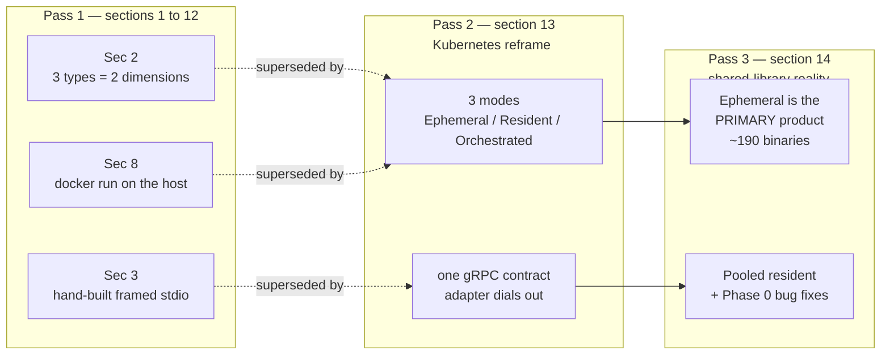
```mermaid
flowchart LR
    subgraph P1["Pass 1 — sections 1 to 12"]
        A["Sec 2<br/>3 types = 2 dimensions"]
        B["Sec 3<br/>hand-built framed stdio"]
        C["Sec 8<br/>docker run on the host"]
    end
    subgraph P2["Pass 2 — section 13<br/>Kubernetes reframe"]
        D["3 modes<br/>Ephemeral / Resident / Orchestrated"]
        E["one gRPC contract<br/>adapter dials out"]
    end
    subgraph P3["Pass 3 — section 14<br/>shared-library reality"]
        F["Ephemeral is the<br/>PRIMARY product<br/>~190 binaries"]
        G["Pooled resident<br/>+ Phase 0 bug fixes"]
    end
    A -.superseded by.-> D
    B -.superseded by.-> E
    C -.superseded by.-> D
    D --> F
    E --> G
```

**Diagram key** — a node outlined in **green** is the recommended path, in **red** a trap or
rejected option, in **amber** something to watch. Everything else is neutral.

*Sections 11 and 12 (resource limits, stdio performance) survive intact — but section 13 makes
most of section 11 unnecessary in Orchestrated mode, and section 13.3 removes the need for the
custom framing that section 12 was optimising.*

---

### Where the connections live — the core of the verdict

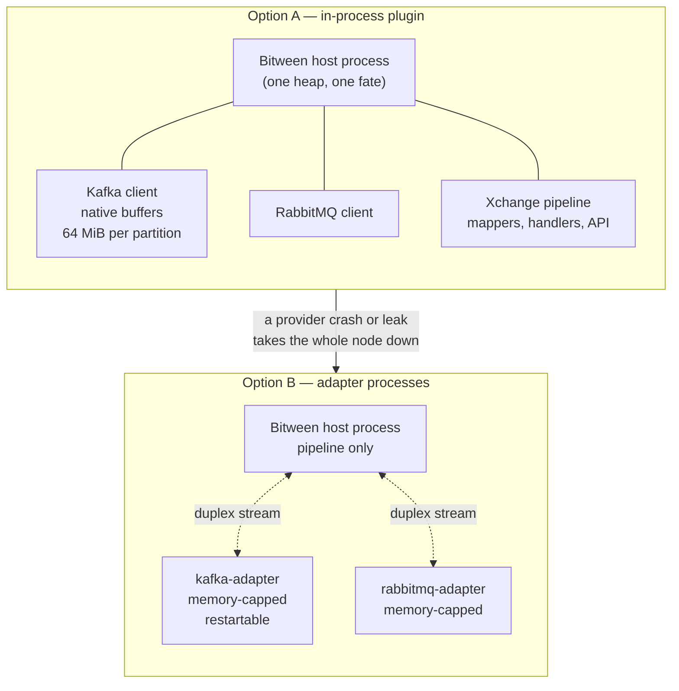
```mermaid
flowchart TB
    subgraph OPT1["Option A — in-process plugin"]
        direction TB
        H1["Bitween host process<br/>(one heap, one fate)"]
        H1 --- K1["Kafka client<br/>native buffers<br/>64 MiB per partition"]
        H1 --- R1["RabbitMQ client"]
        H1 --- APP["Xchange pipeline<br/>mappers, handlers, API"]
    end
    subgraph OPT2["Option B — adapter processes"]
        direction TB
        H2["Bitween host process<br/>pipeline only"]
        H2 <-.duplex stream.-> P1["kafka-adapter<br/>memory-capped<br/>restartable"]
        H2 <-.duplex stream.-> P2["rabbitmq-adapter<br/>memory-capped"]
    end
    OPT1 -->|"a provider crash or leak<br/>takes the whole node down"| OPT2
```

*Left: broker memory and crash risk land on the Bitween heap. Right: they land on a process you
can cap, restart, and place independently.*

The idea is right, and it is the strongest available answer to the "install a bus provider at
runtime" requirement. But be clear about what is actually being bought and what it costs:

**What you gain that the in-proc plugin design cannot give you:**

| | In-proc plugin (§4 as written) | Resident serverless adapter |
|---|---|---|
| Install without redeploy | No — assembly loaded at startup | **Yes** — already the whole point of `Install()` |
| Non-.NET providers (Pulsar/Java, MQTT/Go, Python) | Impossible | **Yes**, via container launcher |
| Native deps (librdkafka) | Loads into the host process | **Isolated**, and cappable |
| Memory pressure from live connections | Lands on the Bitween node's heap | **Lands on a process you can `--memory` cap** |
| A provider that crashes | Can take the node down | Kills one adapter, supervisor restarts it |
| Provider versions side by side | ALC hell | Free — separate processes, separate dirs |

That last-but-one row directly answers the node-pressure worry in §10 of the architecture doc:
librdkafka's default `queued.max.messages.kbytes` is 64 MiB **per partition**. In-process, a
30-partition topic silently adds ~2 GB to the Bitween host. Out-of-process, it is a container
with a memory limit and a restart policy.

**What it costs:** the current stdio protocol cannot carry this workload. That is the real
project — not the process model, not Docker. See §3.

**Recommendation:** do it, and *replace* the in-proc plugin model rather than supporting both.
Two provider hosting models is the worst outcome — double the surface, double the bugs, and
every provider author has to pick.

---

## 2. Reframe: two dimensions, not three types

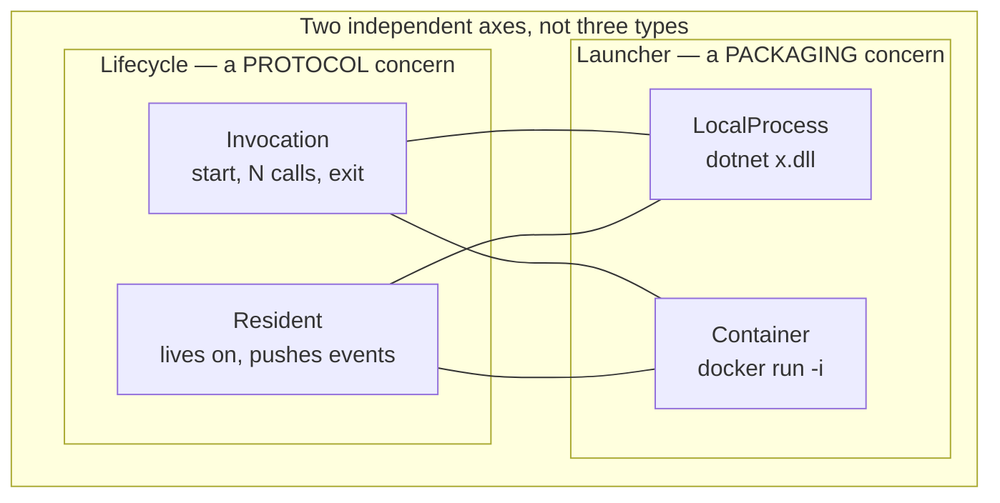
```mermaid
flowchart TB
    subgraph AX["Two independent axes, not three types"]
        direction LR
        subgraph L["Lifecycle — a PROTOCOL concern"]
            L1["Invocation<br/>start, N calls, exit"]
            L2["Resident<br/>lives on, pushes events"]
        end
        subgraph W["Launcher — a PACKAGING concern"]
            W1["LocalProcess<br/>dotnet x.dll"]
            W2["Container<br/>docker run -i"]
        end
    end
    L1 --- W1
    L1 --- W2
    L2 --- W1
    L2 --- W2
```

*Docker is not a third type. `docker run -i` hands you the same three pipes, so it is a second
**launcher** for the same protocol. Keeping the axes separate means a resident RabbitMQ adapter
and an invocation-scoped mapper share one protocol implementation.*

"Three types of adapter" will produce three divergent code paths. There are really two
independent axes:

```
AdapterRuntime
  ├─ Lifecycle : Invocation | Resident
  └─ Launcher  : LocalProcess | Container   ( | InProcess, for native.* )
```

* **Lifecycle** is a *protocol* concern — who initiates, how many calls are in flight, does the
  adapter push.
* **Launcher** is a *packaging* concern — how the process is spawned and constrained.

Docker is not a third adapter type; it is a second launcher for the same protocol
(`docker run -i` gives you exactly the same stdin/stdout pipes). Keeping these orthogonal means
a resident RabbitMQ adapter and an invocation-scoped mapper share one protocol implementation,
and a container-packaged mapper works for free.

**Where the flags live:** nowhere new. `GetAdapterMetadata` already reads an arbitrary
`IDictionary<string,string>` off the cloud object and passes it into the adapter as
`AdapterValues`. Today it reads `EntryAssembly` and `Hash`. Add:

| Metadata key | Values | Meaning |
|---|---|---|
| `Protocol` | absent \| `2` | absent ⇒ v1 line protocol, verbatim existing code path |
| `Lifecycle` | `invocation` (default) \| `resident` | |
| `Launcher` | `process` (default) \| `container` | |
| `Image` | e.g. `ghcr.io/…/kafka-adapter:1.4.0` | container launcher only |
| `MaxInFlight` | int | protocol credit window |
| `Capabilities` | csv | `subscribe,publish,topology,browse,query` — §3.8 of the arch doc |

Backward compatibility is then trivial and *provable*: an adapter with no `Protocol` key takes
the existing code path byte for byte. Old adapters are already-published binaries against a
pinned SDK version; they never see the new code.

---

## 3. Challenge 1 — the protocol is the whole project

### The single-completion-source hazard, drawn

This is the defect behind items 1 and 2 below. It is **live in Traxis production today** — see
section 14.3.

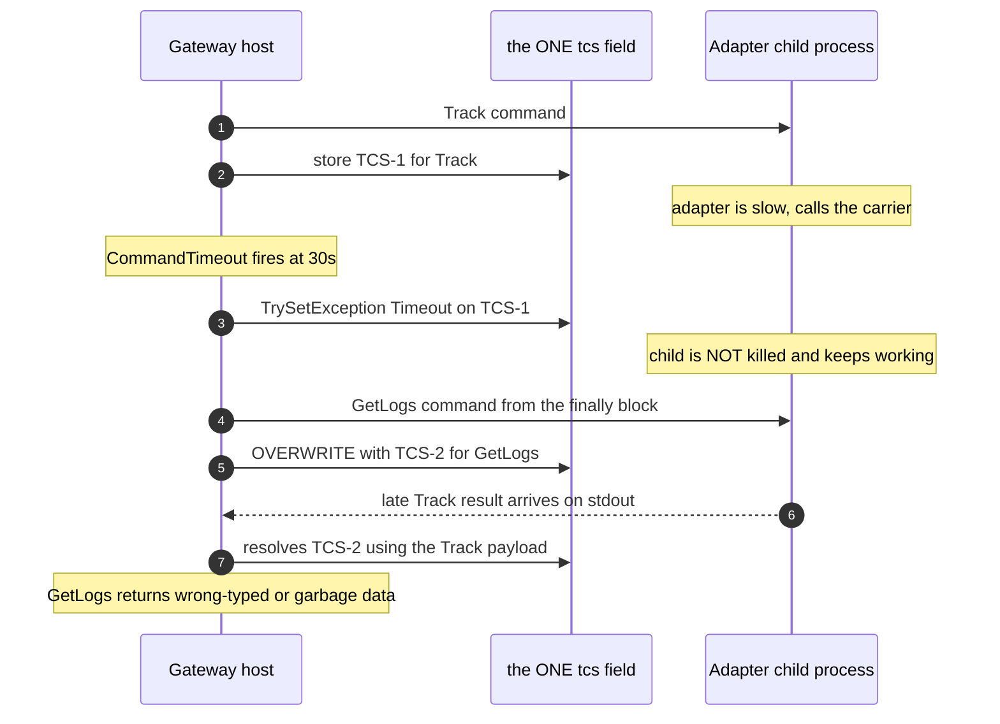
```mermaid
sequenceDiagram
    autonumber
    participant G as Gateway host
    participant T as the ONE tcs field
    participant A as Adapter child process
    G->>A: Track command
    G->>T: store TCS-1 for Track
    Note over A: adapter is slow, calls the carrier
    Note over G: CommandTimeout fires at 30s
    G->>T: TrySetException Timeout on TCS-1
    Note over A: child is NOT killed and keeps working
    G->>A: GetLogs command from the finally block
    G->>T: OVERWRITE with TCS-2 for GetLogs
    A-->>G: late Track result arrives on stdout
    G->>T: resolves TCS-2 using the Track payload
    Note over G: GetLogs returns wrong-typed or garbage data
```

*There is no correlation id in the protocol, so stdout is pure FIFO trust. One timeout
permanently desynchronises the stream for the rest of that process's life.*

---

### What the v1 protocol can and cannot carry

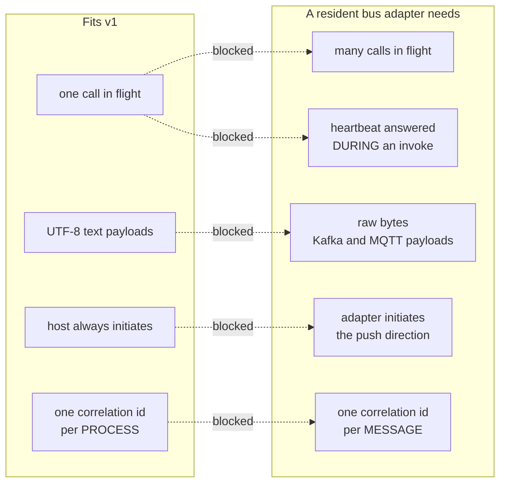
```mermaid
flowchart LR
    subgraph OK["Fits v1"]
        O1["one call in flight"]
        O2["UTF-8 text payloads"]
        O3["host always initiates"]
        O4["one correlation id<br/>per PROCESS"]
    end
    subgraph NEED["A resident bus adapter needs"]
        N1["many calls in flight"]
        N2["raw bytes<br/>Kafka and MQTT payloads"]
        N3["adapter initiates<br/>the push direction"]
        N4["one correlation id<br/>per MESSAGE"]
        N5["heartbeat answered<br/>DURING an invoke"]
    end
    O1 -.->|blocked| N1
    O2 -.->|blocked| N2
    O3 -.->|blocked| N3
    O4 -.->|blocked| N4
    O1 -.->|blocked| N5
```

Verified against `SW.Serverless/Services/ServerlessService.cs` and `SW.Serverless.Sdk/Runner.cs`:

1. **One call in flight, ever.** `ServerlessService` holds a single `taskCompletionSource` field,
   overwritten on every `InvokeAsync`. There are no message ids, so responses cannot be
   correlated. A resident bus adapter needs many concurrent operations.
2. **stdout is assumed to be responses only.** `OutputDataReceived` disposes
   `invocationTimeoutTimer` on *any* line and resolves the pending TCS with it. An adapter that
   spontaneously emits "I received a Kafka message" will cancel and corrupt an unrelated
   in-flight invoke. Push is not merely unsupported — it is actively unsafe.
3. **The adapter suicides when idle.** `Runner.Run` arms `idleTimer` before every read and
   throws `TimeoutException` from the timer callback (i.e. crashes the process) after
   `ServerlessOptions.IdleTimeout`. A resident adapter that is quietly listening is, by
   definition, idle.
4. **`CorrelationId` is a per-process startup value.** A resident adapter handles thousands of
   correlations over its life. Correlation must move to the message envelope.
5. **The protocol cannot carry binary.** Frames are single UTF-8 lines with `\n` → `{{newline}}`
   escaping and `#!#` delimiters. Kafka and MQTT payloads are `byte[]`. Base64 in a JSON string
   would work but costs +33% and forces the whole payload through one console line. This is a
   hard blocker, not a nice-to-have.
6. **Startup values are passed on `argv`, base64-encoded** — visible in `ps aux` to any local
   user. That is already true today and already carries adapter secret properties; for broker
   credentials it is not acceptable. Config must move to a first stdin frame.
7. **EOF spins hot.** In `Runner.Run`, `ReadLineAsync` returning `null` (parent process gone)
   hits `if (input == null) continue;` — an infinite loop that re-arms and disposes a `Timer` on
   every iteration. Today the idle timer eventually kills it; a resident adapter with no idle
   timeout would spin a core forever as an orphan. **Null read must mean "parent died, exit".**

### 3.1 Protocol v2

> **Amended by section 15.** The judgement below is about gRPC over **localhost TCP**, and it
> stands. Section 13.3 proposes gRPC over a **Unix domain socket / named pipe** — an IPC object,
> not a network socket — which keeps every property defended here. See section 15.1.

Keep stdio. It is the design's quiet superpower: no ports, no port allocation, no bind
addresses, no auth token, no firewall rule, no container network config — and it works
identically for `dotnet x.dll` and `docker run -i`. gRPC-over-localhost buys better tooling and
costs all of that back.

What changes is framing:

```
[ u32 length ][ u8 frameType ][ u32 headerLen ][ header: UTF-8 JSON ][ body: raw bytes ]
```

* **Length-prefixed** — no escaping, no line limits, binary-safe.
* **`header.id`** — a monotonic id per direction. Responses echo it. Enables multiplexing.
* **`body`** — untouched bytes. A Kafka payload passes through with zero transformation.
* **Symmetric.** Both sides can be caller and callee. Frame types:
  `request`, `response`, `error`, `log`, `metric`, `event`, `ack`, `ping`, `pong`, `control`.
* **Credit-based flow control.** The host grants `MaxInFlight`; the adapter must not exceed it.
  Without this, an adapter reading Kafka faster than the host persists Xchanges just buffers
  until OOM.

Host side becomes a `ConcurrentDictionary<long, TaskCompletionSource>` plus a read loop — which
also removes the reflection-over-`TaskCompletionSource<T>` hack in `ServerlessService`.

**Do not multiplex over stdout while also using stderr for logs.** In v2, logs are `log` frames
on the same stream. stderr becomes what it should be: unstructured crash output, captured into a
ring buffer for forensics (§6.7).

---

## 4. Challenge 2 — lifetime and DI

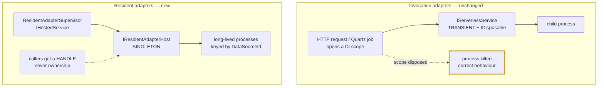
```mermaid
flowchart TB
    subgraph SCOPED["Invocation adapters — unchanged"]
        S1["HTTP request / Quartz job<br/>opens a DI scope"]
        S2["IServerlessService<br/>TRANSIENT + IDisposable"]
        S3["child process"]
        S1 --> S2 --> S3
        S1 -.scope disposed.-> S4["process killed<br/>correct behaviour"]
    end
    subgraph RESIDENT["Resident adapters — new"]
        R1["ResidentAdapterSupervisor<br/>IHostedService"]
        R2["IResidentAdapterHost<br/>SINGLETON"]
        R3["long-lived processes<br/>keyed by DataSourceId"]
        R1 --> R2 --> R3
        R4["callers get a HANDLE<br/>never ownership"] -.-> R2
    end
    style S4 stroke:#cf9a2e,stroke-width:3px
```

*The existing transient registration is right for invocation adapters and fatal for resident
ones — a DI scope ending must never kill a broker connection.*

---

### The supervisor is the reconciliation loop you already designed

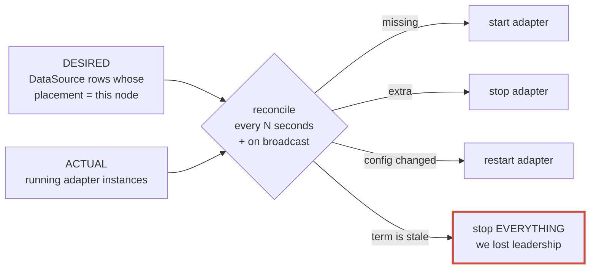
```mermaid
flowchart LR
    A["DESIRED<br/>DataSource rows whose<br/>placement = this node"] --> R{"reconcile<br/>every N seconds<br/>+ on broadcast"}
    B["ACTUAL<br/>running adapter instances"] --> R
    R -->|missing| C["start adapter"]
    R -->|extra| D["stop adapter"]
    R -->|config changed| E["restart adapter"]
    R -->|term is stale| F["stop EVERYTHING<br/>we lost leadership"]
    style F stroke:#d24b3c,stroke-width:3px
```

`IServerlessService` is registered **transient** and is `IDisposable`; every consumer in Bitween
does `GetRequiredService<IServerlessService>()` inside a scope
(`XchangeService`, `ReceivingJob`, `AdapterInvoker`, `GetProperties`, …). Disposing the scope
kills the process. That is exactly right for invocation adapters and exactly wrong for resident
ones.

So:

* `IServerlessService` — **unchanged**, transient, invocation lifecycle. No consumer changes.
* `IResidentAdapterHost` — **singleton**, owns a `ConcurrentDictionary<AdapterInstanceKey, ResidentAdapterInstance>`
  keyed by `(adapterId, instanceKey)` where `instanceKey` is the `DataSourceId`. Callers get a
  *handle*, never ownership.
* `ResidentAdapterSupervisor` — `IHostedService`, the reconciliation loop.

**The supervisor is the loop already designed in §5 of the architecture doc.** Desired state =
`DataSource` rows whose placement resolves to this node; actual state = running instances;
reconcile every N seconds and on `RefreshConsumers`-style broadcast. Nothing about the cluster,
placement, or leader-election design changes — only *what a provider is* changes, from a loaded
type to a supervised process.

---

## 5. Challenge 3 — the push direction (the crux for bus)

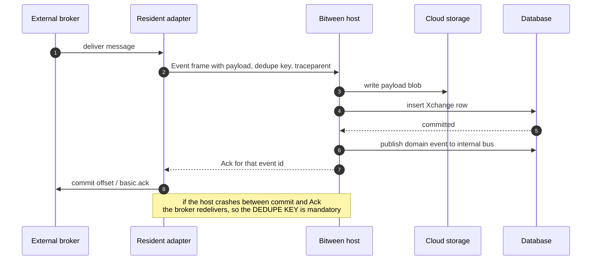
```mermaid
sequenceDiagram
    autonumber
    participant B as External broker
    participant A as Resident adapter
    participant H as Bitween host
    participant S as Cloud storage
    participant D as Database
    B->>A: deliver message
    A->>H: Event frame with payload, dedupe key, traceparent
    H->>S: write payload blob
    H->>D: insert Xchange row
    D-->>H: committed
    H->>D: publish domain event to internal bus
    H-->>A: Ack for that event id
    A->>B: commit offset / basic.ack
    Note over H,A: if the host crashes between commit and Ack<br/>the broker redelivers, so the DEDUPE KEY is mandatory
```

*The adapter must not acknowledge the broker until Bitween has durably persisted. That makes the
transport bidirectional — the adapter is a caller too — and makes at-least-once delivery, hence
deduplication, a hard requirement rather than an open question.*

---

### Why the rejected alternative is worse

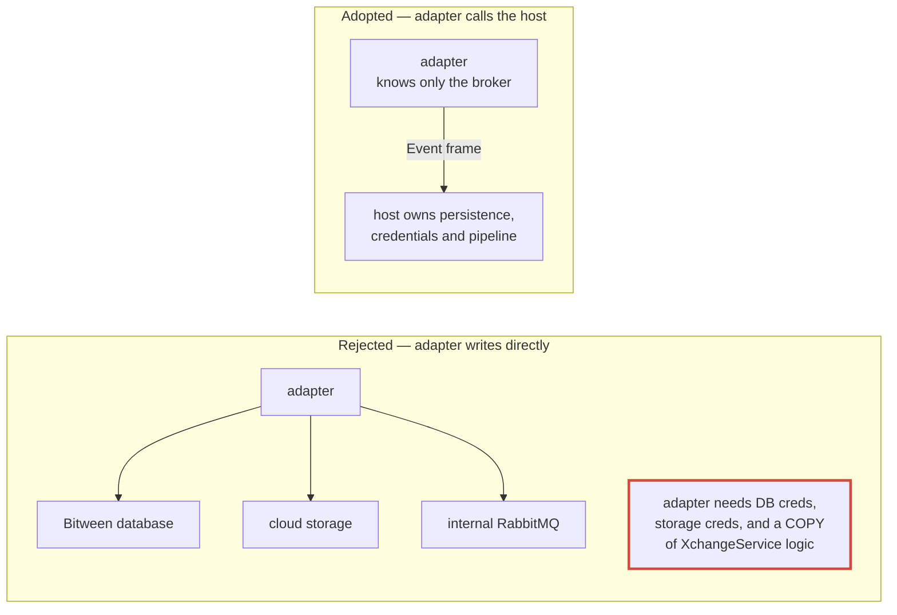
```mermaid
flowchart LR
    subgraph BAD["Rejected — adapter writes directly"]
        A1["adapter"] --> DB1["Bitween database"]
        A1 --> S1["cloud storage"]
        A1 --> BUS1["internal RabbitMQ"]
        X["adapter needs DB creds,<br/>storage creds, and a COPY<br/>of XchangeService logic"]
    end
    subgraph GOOD["Adopted — adapter calls the host"]
        A2["adapter<br/>knows only the broker"] -->|Event frame| H2["host owns persistence,<br/>credentials and pipeline"]
    end
    style X stroke:#d24b3c,stroke-width:3px
```

A resident bus adapter receives a message and must get it into `XchangeService`. Two options:

**Rejected: adapter writes straight to the DB / internal bus.** It would need Bitween's database
credentials, cloud-storage credentials, and a copy of `XchangeService`'s persist logic. Every
provider author would reimplement it, badly. It also destroys the "non-opinionated plugin"
premise.

**Adopted: adapter → host RPC over the same protocol.** The adapter sends an `event` frame; the
host runs the existing ingest path (persist Xchange → write payload to cloud storage → commit →
domain event) and replies with `ack` or `nack`. Only then does the adapter commit the Kafka
offset / `basic.ack` the RabbitMQ delivery.

This is why the protocol must be **bidirectional and symmetric from day one**. Retrofitting the
reverse direction later is the kind of change that forces a v3.

Consequences that are now mandatory rather than optional:

* **At-least-once, therefore dedupe.** The host can persist and crash before the ack lands; the
  broker redelivers. The dedupe key listed as an open question in §12 of the architecture doc
  becomes a requirement. Provider supplies it (Kafka: `topic:partition:offset`; RabbitMQ:
  message-id or a content hash), host enforces uniqueness.
* **Ordering is per-adapter-instance at best.** With `MaxInFlight > 1` the host may commit
  Xchanges out of order. If a provider needs ordering, it must serialize per key itself and the
  descriptor must say so.
* **Backpressure is the adapter's job.** The credit window is the mechanism; the adapter must
  stop fetching, not buffer.

---

## 6. Observability

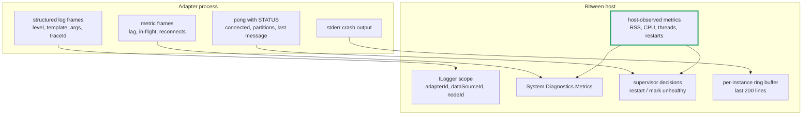
```mermaid
flowchart TB
    subgraph AD["Adapter process"]
        A1["structured log frames<br/>level, template, args, traceId"]
        A2["metric frames<br/>lag, in-flight, reconnects"]
        A3["pong with STATUS<br/>connected, partitions, last message"]
        A4["stderr crash output"]
    end
    subgraph HOST["Bitween host"]
        H1["ILogger scope<br/>adapterId, dataSourceId, nodeId"]
        H2["System.Diagnostics.Metrics"]
        H3["supervisor decisions<br/>restart / mark unhealthy"]
        H4["per-instance ring buffer<br/>last 200 lines"]
        H5["host-observed metrics<br/>RSS, CPU, threads, restarts"]
    end
    A1 --> H1
    A2 --> H2
    A3 --> H3
    A4 --> H4
    H5 --> H3
    H5 --> H2
    style H5 stroke:#1f9d63,stroke-width:3px
```

*The green box matters most: host-observed metrics need no adapter cooperation, so they still
work **when the adapter is wedged** — which is exactly when you need them.*

---

### The three states a heartbeat must distinguish

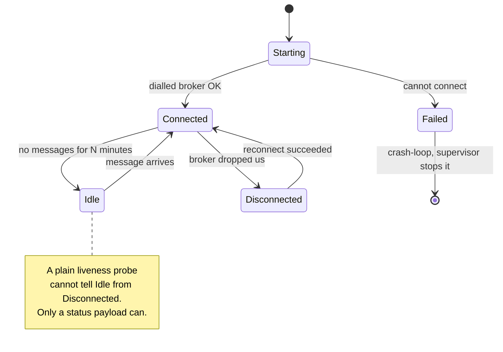
```mermaid
stateDiagram-v2
    [*] --> Starting
    Starting --> Connected: dialled broker OK
    Starting --> Failed: cannot connect
    Connected --> Idle: no messages for N minutes
    Idle --> Connected: message arrives
    Connected --> Disconnected: broker dropped us
    Disconnected --> Connected: reconnect succeeded
    Failed --> [*]: crash-loop, supervisor stops it
    note right of Idle
        A plain liveness probe
        cannot tell Idle from Disconnected.
        Only a status payload can.
    end note
```

This is the part that decides whether the design is operable. Today it is: stderr lines prefixed
`{{log.information}}` / `{{log.warning}}` / `{{log.error}}`, string-replaced into an
`ILogger` named `serverless.adapters.{adapterId}`. No structure, no trace, no metrics, no health.
For an invocation adapter that is survivable, because the Xchange record *is* the trace. For a
resident adapter that runs for weeks and owns an ingress, it is not.

Seven things, in priority order:

### 6.1 Structured log frames
Replace prefix-parsing with a `log` frame:
`{ level, message, exception, timestamp, template, properties, correlationId, traceId }`.
Host calls `ILogger.Log` inside a scope carrying `adapterId`, `instanceKey`, `dataSourceId`,
`nodeId`. No new sink infrastructure — it lands wherever Bitween's logs already land, but now
queryable by data source instead of grep-able by string.

Add a `control` command `setLogLevel` so verbosity is changeable at runtime, per adapter
instance. This matters more than it sounds: N resident adapters per node multiplies log volume,
and you want debug on for *one* misbehaving data source, not all of them.

### 6.2 Trace propagation, both directions
`System.Diagnostics.Activity` / W3C `traceparent` in every frame header.

* Host → adapter: current activity id, so an adapter's work nests under the caller.
* Adapter → host push: the adapter starts the activity, and **links it to the broker message's
  own `traceparent` header** when present — Kafka, RabbitMQ, MQTT5 and Pulsar all carry headers,
  and upstream producers instrumented with OpenTelemetry set it.

The payoff is one trace spanning *producer → broker → adapter → Xchange → mapper → handler*.
This is the single feature that makes cross-process debugging bearable, and it is the thing
in-proc plugins would have given you for free — so it has to be built deliberately.

### 6.3 Metrics
Two independent sources, deliberately:

* **Adapter-reported**, via `metric` frames on a timer: messages received / acked / nacked,
  consumer lag, in-flight count, reconnect count, last error, broker-specific gauges. Host
  republishes on `System.Diagnostics.Metrics` so they export through whatever Bitween already
  uses.
* **Host-observed**, requiring no adapter cooperation: `Process.WorkingSet64`,
  `TotalProcessorTime` delta, thread count, handle count, restart count, uptime — sampled by the
  supervisor. For containers, `docker stats` / cgroup files.

The second source is the important one, because **it still works when the adapter is wedged**.
It also feeds the node-health screen in §10 of the architecture doc directly, with real numbers
instead of estimates.

### 6.4 Heartbeat that means something
A `ping` frame with a deadline; the adapter answers `pong` with a **status object**, not just
liveness: connected yes/no, subscribed partitions/queues, lag, timestamp of last received
message, last exception. This distinguishes the three states operators actually care about —
*process dead*, *process alive but disconnected*, *connected but receiving nothing* — which a
plain liveness check conflates.

Note this must be answerable **while messages are in flight**, which is another reason the
protocol has to be multiplexed. A heartbeat that queues behind a 30-second invoke is a false
alarm generator.

Missed N pings ⇒ restart. This is also exactly what the UI's per-gateway status badge renders.

### 6.5 Per-message correlation
Adapter generates a correlation id per pushed message, puts it in the `event` frame, host stores
it on the Xchange and echoes it in the `ack`. Now an adapter log line joins to an Xchange row.
The current per-process `CorrelationId` cannot express this at all.

### 6.6 Reuse the existing test-connection path
The "test connection" and "discover cluster" commands from the RabbitMQ provider plan become
ordinary `request` frames against a **transient** instance of the same adapter — same code,
same protocol, no second implementation. That is a real simplification the in-proc design did
not offer.

### 6.7 Crash forensics
A resident adapter that dies at 03:00 must leave evidence. On abnormal exit, persist a
`data_source_incident` row: exit code, signal, last N stderr lines (ring buffer, per instance),
last frames exchanged, restart count in window. Surface the ring buffer in the UI as
"last 200 lines" so the diagnose loop does not require access to the central log store —
disproportionately useful for the configure-and-test UX.

---

## 7. Challenge 4 — failure, restart, split-brain

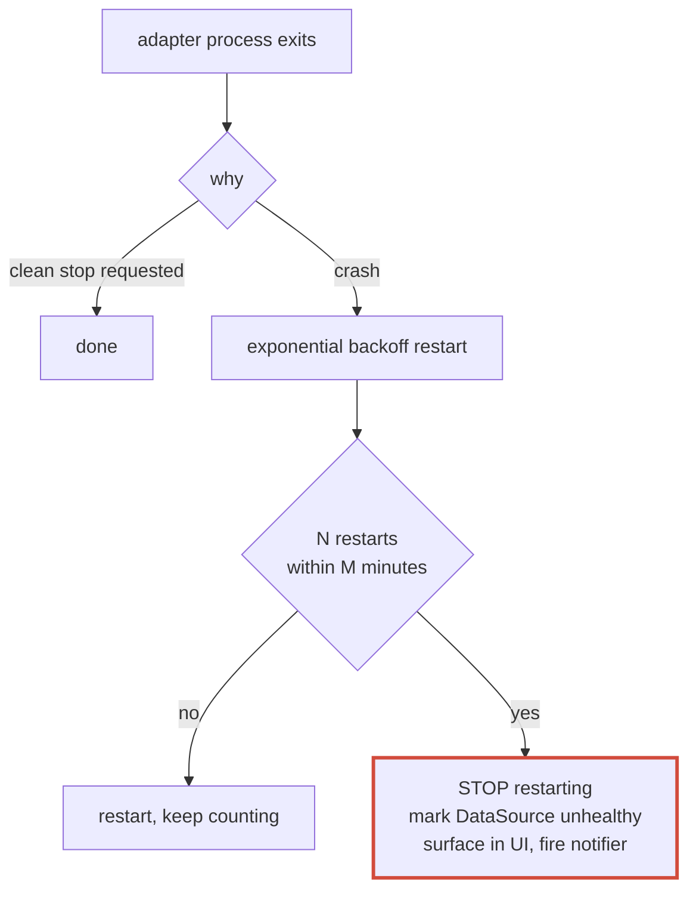
```mermaid
flowchart TB
    START["adapter process exits"] --> Q{"why"}
    Q -->|clean stop requested| OK["done"]
    Q -->|crash| BACKOFF["exponential backoff restart"]
    BACKOFF --> COUNT{"N restarts<br/>within M minutes"}
    COUNT -->|no| BACKOFF2["restart, keep counting"]
    COUNT -->|yes| STOP["STOP restarting<br/>mark DataSource unhealthy<br/>surface in UI, fire notifier"]
    style STOP stroke:#d24b3c,stroke-width:3px
```

*A silent restart loop is worse than a hard stop — it burns broker connections and hides the
fault.*

---

### The four failure directions

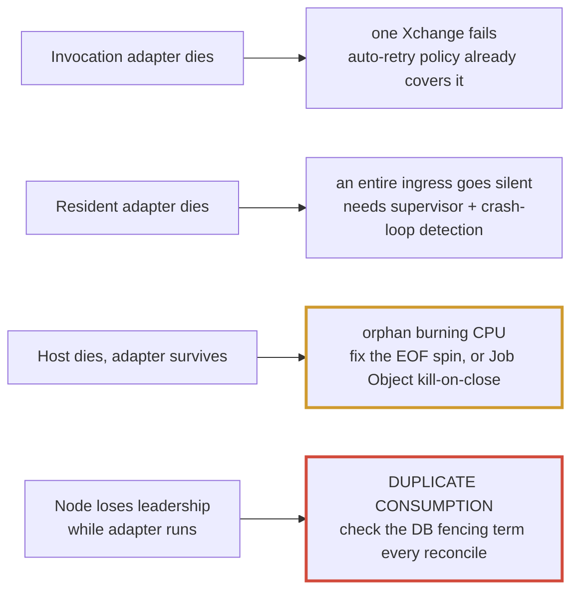
```mermaid
flowchart LR
    F1["Invocation adapter dies"] --> R1["one Xchange fails<br/>auto-retry policy already covers it"]
    F2["Resident adapter dies"] --> R2["an entire ingress goes silent<br/>needs supervisor + crash-loop detection"]
    F3["Host dies, adapter survives"] --> R3["orphan burning CPU<br/>fix the EOF spin, or Job Object kill-on-close"]
    F4["Node loses leadership<br/>while adapter runs"] --> R4["DUPLICATE CONSUMPTION<br/>check the DB fencing term every reconcile"]
    style R4 stroke:#d24b3c,stroke-width:3px
    style R3 stroke:#cf9a2e,stroke-width:3px
```

* **Invocation adapter dies** — one Xchange fails, the auto-retry policy already covers it.
* **Resident adapter dies** — an entire ingress goes silent. Needs: supervisor detects exit,
  exponential backoff restart, **crash-loop detection** (N restarts in M minutes ⇒ stop, mark the
  `DataSource` unhealthy, surface in UI, fire a notifier). A silent restart loop is worse than a
  hard stop.
* **Host dies, adapter survives** — must not happen. Fix the EOF spin (§3, item 7) so a null read
  means exit, and additionally have the adapter poll its parent PID.
* **Node loses leadership while the adapter runs** — the process must be killed *before* another
  node starts its own, or you get duplicate consumption. This is where the DB fencing token from
  §6.1 of the architecture doc earns its keep: the supervisor checks the term before every
  reconcile, and a stale term means "stop everything immediately".

---

## 8. Challenge 5 — the container launcher

**Why it is worth having:** non-.NET provider clients (Pulsar's mature client is Java; good MQTT
and Go clients exist), native dependencies like librdkafka, hard resource limits (`--memory`,
`--cpus`, `--pids-limit`), and a real security boundary for third-party provider code.

**What it costs, honestly:**

* The Bitween process needs access to a Docker socket. Mounting `/var/run/docker.sock` into a
  containerized Bitween is a privilege escalation to root-on-host; DinD is worse. This is a
  genuine security conversation, not a config flag.
* Image pull credentials, per-node image cache, cold-start on first pull (seconds to minutes).
* Not available everywhere: App Service, hardened k8s without socket access, some managed hosts.
* In Kubernetes the idiomatic answer is not `docker run` — it is a sidecar or a Job. So the
  launcher must stay pluggable and you should not over-invest in the Docker one.

**Therefore:** define `IAdapterLauncher { StartAsync, StopAsync, GetResourceUsageAsync }`, ship
`ProcessLauncher` first, and gate `ContainerLauncher` behind a node capability probe. A
`DataSource` whose adapter requires `Launcher=container` simply will not be placed on a node
that reports no container runtime — which is exactly what the §6.2 placement layer is for.

Protocol-wise the container launcher is free: `docker run -i --rm` gives the same three pipes.

---

## 9. What this costs you (the counter-argument, stated fairly)

* **Debuggability of provider code.** In-proc, you attach a debugger and step through. Out-of-proc,
  you debug IPC. Mitigation: `Runner.MockRun` already exists for in-test adapter hosting; extend
  it to the resident lifecycle so provider logic is unit-testable without a process.
* **Integration test complexity.** A test now needs a *published* adapter. Precedent exists —
  `AdapterInstaller` in `BitweenFixture` already publishes and uploads sample adapters — but
  every provider test inherits that cost, on top of the Testcontainers broker.
* **Latency on enrichment.** `IQueryCapable` (a mapper querying a data source, §3.8) becomes an
  IPC round trip: roughly 0.1–1 ms instead of ~0. Against the measured Traxis baseline — 32.67 s
  p50 handler time versus 0.33 s of total plumbing — this is noise. It would matter only if
  a mapper did thousands of lookups per message.
* **Two moving parts to version.** Protocol version negotiation must be explicit and checked at
  startup, with a clear error, or you get mysterious hangs.

None of these outweigh runtime installability and connection isolation for the bus use case.
All of them would outweigh it for, say, a JSON mapper — which is precisely why the invocation
lifecycle stays exactly as it is.

---

## 10. Sequencing

| Phase | Work | Why here |
|---|---|---|
| **0** | Fix `argv` secret exposure; fix EOF hot-spin; keep v1 behaviour otherwise | Both are live bugs today, independent of this design |
| **1** | Protocol v2: framed, multiplexed, binary body, symmetric, credit-based. v1 fallback keyed on absent `Protocol` metadata | Everything else depends on it |
| **2** | `IResidentAdapterHost` + `ResidentAdapterSupervisor` + log/metric/ping/trace frames; prove with a trivial "tick" resident adapter | Runtime and observability before any real provider |
| **3** | RabbitMQ resident bus adapter | The provider design in `provider-plan-rabbitmq-kafka.md` is unchanged — only where it runs changes |
| **4** | `ContainerLauncher` + node capability probe | Needed before Kafka if librdkafka is containerized |
| **5** | Kafka resident bus adapter | Highest client demand, hardest resource profile |

Phases 0–2 are the real investment and buy nothing visible to a customer. Worth saying out loud
before committing, because it is the part that gets cut under pressure and it is the part that
cannot be retrofitted.

---

## 11. Resource limits without Docker

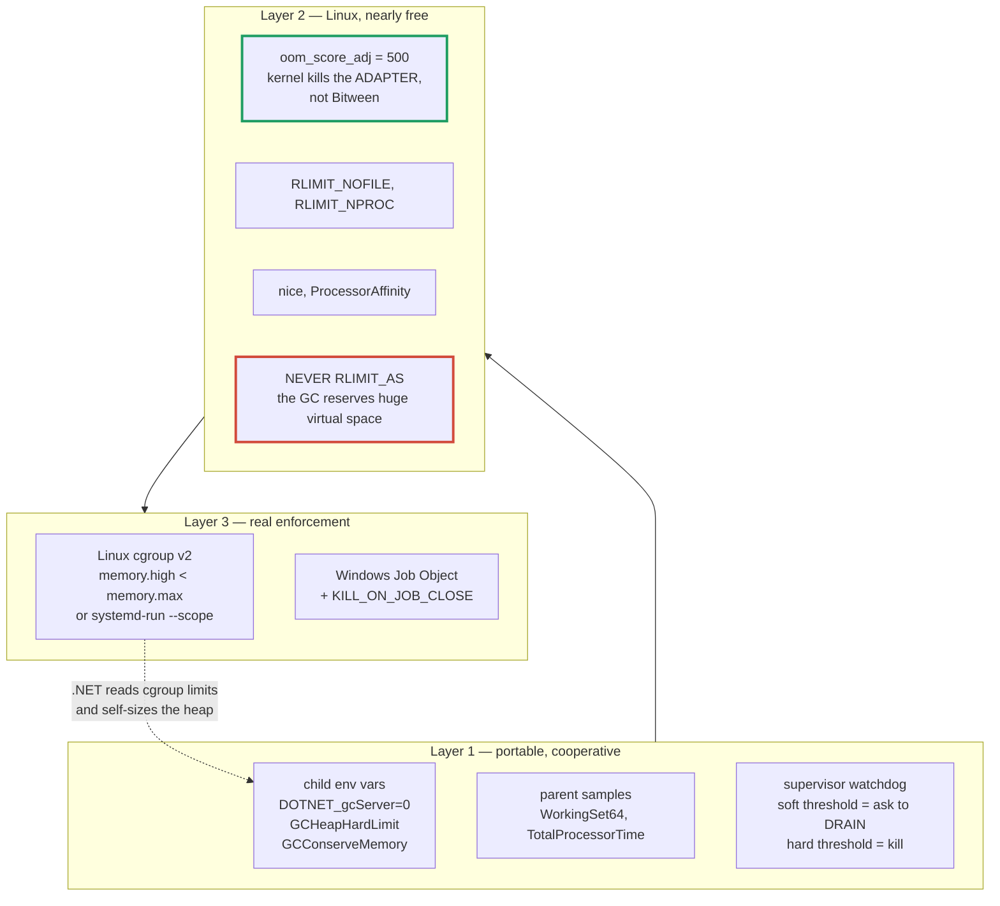
```mermaid
flowchart TB
    subgraph L1["Layer 1 — portable, cooperative"]
        A1["child env vars<br/>DOTNET_gcServer=0<br/>GCHeapHardLimit<br/>GCConserveMemory"]
        A2["parent samples<br/>WorkingSet64, TotalProcessorTime"]
        A3["supervisor watchdog<br/>soft threshold = ask to DRAIN<br/>hard threshold = kill"]
    end
    subgraph L2["Layer 2 — Linux, nearly free"]
        B1["oom_score_adj = 500<br/>kernel kills the ADAPTER,<br/>not Bitween"]
        B2["RLIMIT_NOFILE, RLIMIT_NPROC"]
        B3["nice, ProcessorAffinity"]
        B4["NEVER RLIMIT_AS<br/>the GC reserves huge virtual space"]
    end
    subgraph L3["Layer 3 — real enforcement"]
        C1["Linux cgroup v2<br/>memory.high < memory.max<br/>or systemd-run --scope"]
        C2["Windows Job Object<br/>+ KILL_ON_JOB_CLOSE"]
    end
    L1 --> L2 --> L3
    C1 -.->|".NET reads cgroup limits<br/>and self-sizes the heap"| A1
    style B4 stroke:#d24b3c,stroke-width:3px
    style B1 stroke:#1f9d63,stroke-width:3px
```

*Layer 3 makes Layer 1 self-tuning: .NET detects a cgroup memory limit and sizes its heap to
about 75% of it automatically.*

---

### Why the watchdog is needed even when Layer 3 exists

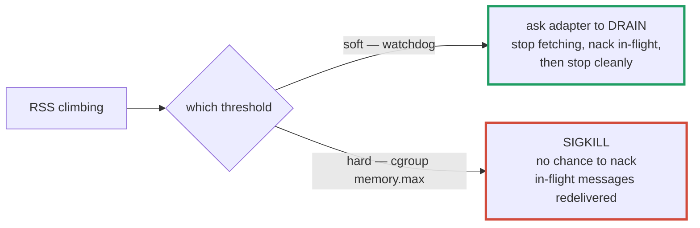
```mermaid
flowchart LR
    M["RSS climbing"] --> S{"which threshold"}
    S -->|"soft — watchdog"| D1["ask adapter to DRAIN<br/>stop fetching, nack in-flight,<br/>then stop cleanly"]
    S -->|"hard — cgroup memory.max"| D2["SIGKILL<br/>no chance to nack<br/>in-flight messages redelivered"]
    style D1 stroke:#1f9d63,stroke-width:3px
    style D2 stroke:#d24b3c,stroke-width:3px
```

*And note native allocations — librdkafka's fetch buffers are `malloc`, invisible to
`GCHeapHardLimit`. RSS, not GC heap, is the number to watch.*

In §1 and §8 I attributed memory capping to containers. That is imprecise and worth correcting:
**Docker's limits *are* cgroups.** You can have the same enforcement natively. What Docker
uniquely buys is *packaging* — non-.NET runtimes, native deps, image distribution — not limits.
That materially lowers the priority of the container launcher.

Three layers, from portable to enforcing.

### 11.1 Layer 1 — portable: tune the child runtime, watch from the parent

Injected as environment variables at spawn (the host already builds `ProcessStartInfo`):

| Variable | Why it matters for a resident adapter |
|---|---|
| `DOTNET_gcServer=0` | **Biggest single win.** Server GC allocates a heap *and a GC thread per core*. On a 32-core host, 15 resident adapters on Server GC is ~480 GC threads and a very large committed footprint, for processes that are IO-bound and barely allocate. Workstation GC is the correct default for adapters. |
| `DOTNET_GCHeapHardLimit=<hex bytes>` | Hard cap on the managed heap. Crossing it raises `OutOfMemoryException` in the adapter instead of growing into the host's memory. |
| `DOTNET_GCHeapHardLimitPercent` | Same, relative to the cgroup limit / physical memory. Use when Layer 3 is in play. |
| `DOTNET_GCConserveMemory=5..9` | Trades CPU for a smaller footprint. Right trade for an adapter that mostly waits on a socket. |
| `DOTNET_ThreadPool_MaxThreads` | Stops a misbehaving adapter from thread-storming the box. |
| `DOTNET_TieredPGO=0`, `DOTNET_ReadyToRun=1` | Lower startup cost and code-heap size; matters when the supervisor restarts adapters. |

**The critical caveat: `GCHeapHardLimit` does not bound native allocations.** librdkafka's fetch
buffers are `malloc`, entirely outside GC accounting. For Kafka the only real control is
librdkafka's own `queued.max.messages.kbytes` / `queued.min.messages` / `fetch.max.bytes`. So
the provider descriptor must expose those, and the supervisor must treat RSS — not GC heap — as
the number it watches.

Parent-side monitoring is what you already need for §6.3: `Process.WorkingSet64` and
`TotalProcessorTime` are accurate on both Linux and Windows. Note `Process.MaxWorkingSet` is not
a useful lever — Windows-only, and even there a soft trimming hint rather than a limit.

Pair that with a **supervisor watchdog**: sample RSS every few seconds, and on crossing a soft
threshold ask the adapter to drain (stop fetching, finish in-flight, `nack` the rest), then stop
it; on crossing a hard threshold, kill. Operationally this is close to as good as a kernel limit,
because the failure you actually face is a slow leak degrading a node over hours, not an
instantaneous spike — **and it is strictly better than a cgroup OOM kill, which is `SIGKILL`
with no chance to nack in-flight messages.** Build the watchdog even when Layer 3 exists.

Also: `Launcher=process` should read an `Executable` metadata key rather than hardcoding
`dotnet`. That one change lets a provider ship as ReadyToRun or NativeAOT — much lower baseline
RSS and startup — or as a Go/Rust binary, without needing containers at all.

### 11.2 Layer 2 — Linux, nearly free

Two file writes and a spawn flag, high value:

* **`/proc/<pid>/oom_score_adj`** — write a positive value (say `500`) for every adapter. Under
  memory pressure the kernel then kills an *adapter*, not the Bitween host. This is a handful of
  lines and it converts your worst outage mode into a supervised restart.
* **`RLIMIT_NOFILE` / `RLIMIT_NPROC`** — safe, bounds fd and thread storms.
* **`nice` / `ProcessorAffinity`** — `Process.PriorityClass` maps to `nice` on Unix, and
  `ProcessorAffinity` works on Linux. Crude CPU containment that costs nothing.

**Do not use `RLIMIT_AS`.** The .NET GC reserves very large virtual address ranges up front;
an address-space limit kills healthy processes. `ulimit -v` and .NET do not mix.

### 11.3 Layer 3 — real enforcement, per platform

This is what `IAdapterLauncher` exists for.

**Linux — cgroup v2.** Create `/sys/fs/cgroup/<slice>/adapter-<id>/`, write `memory.high`,
`memory.max`, `cpu.max`, `pids.max`, then write the child PID into `cgroup.procs`. Plain file
writes; no P/Invoke, no Docker socket. Set **`memory.high` below `memory.max`** — `high` throttles
and reclaims (backpressure), `max` OOM-kills. That gives the watchdog a window to drain
gracefully before the kernel intervenes.

Bonus synergy: **.NET detects cgroup memory limits automatically** and sizes the GC heap against
them (default heap hard limit ≈75% of the cgroup limit). So Layer 3 makes Layer 1 self-tuning.

The catch is delegation — you need write access to a cgroup subtree, which you do not always
have inside a container or under a restrictive systemd config. Where systemd is present, the
easiest correct launcher is not raw cgroup writes at all:

```
systemd-run --scope --collect -p MemoryMax=512M -p MemoryHigh=384M -p CPUQuota=50% -p TasksMax=64 \
  dotnet /adapters/<hash>/Adapter.dll
```

Declarative limits, no Docker socket, no privilege escalation, stdin/stdout pass through
unchanged. For most on-prem Linux deployments this is the answer, and it should probably ship
*before* `ContainerLauncher`.

**Windows — Job Objects.** The genuine equivalent, and there is no BCL wrapper, so ~100 lines of
P/Invoke: `CreateJobObject` + `SetInformationJobObject` with
`JOBOBJECT_EXTENDED_LIMIT_INFORMATION` (`ProcessMemoryLimit`, `JobMemoryLimit`) and
`JOBOBJECT_CPU_RATE_CONTROL_INFORMATION` (CPU rate cap). Worth it for one flag alone:
**`JOB_OBJECT_LIMIT_KILL_ON_JOB_CLOSE`** — when the Bitween process dies, the OS kills every
adapter it spawned. That is the orphan problem solved by the kernel rather than by the
parent-PID-polling hack in §7.

**macOS** — effectively nothing beyond `setrlimit`. Dev-only; do not design for it.

### 11.4 The per-process baseline is itself a budget item

Every resident adapter carries a fixed cost before it does any work — a .NET console process
with workstation GC is on the order of tens of MB RSS, plus threads and fds. Fifteen data
sources is a real, permanent slice of the node. Consequences:

* **One adapter process per `DataSource`, not per endpoint.** One RabbitMQ connection can serve
  many queues; do not spawn per gateway.
* Consider **one process per provider *type* per node**, multiplexing several data sources of the
  same kind, once the count grows. The protocol already needs an instance key, so leave room for
  it in the addressing even if you start one-per-`DataSource`.
* Measure the baseline for real before committing to placement density — do not take the number
  above as given.

---

## 12. Is stdio performant enough for logging and observability?

### Where the cost actually is

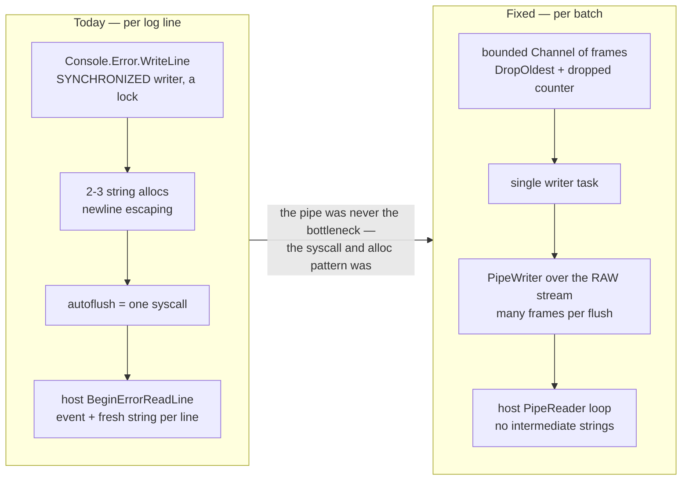
```mermaid
flowchart LR
    subgraph SLOW["Today — per log line"]
        S1["Console.Error.WriteLine<br/>SYNCHRONIZED writer, a lock"]
        S2["2-3 string allocs<br/>newline escaping"]
        S3["autoflush = one syscall"]
        S4["host BeginErrorReadLine<br/>event + fresh string per line"]
        S1 --> S2 --> S3 --> S4
    end
    subgraph FAST["Fixed — per batch"]
        F1["bounded Channel of frames<br/>DropOldest + dropped counter"]
        F2["single writer task"]
        F3["PipeWriter over the RAW stream<br/>many frames per flush"]
        F4["host PipeReader loop<br/>no intermediate strings"]
        F1 --> F2 --> F3 --> F4
    end
    SLOW -->|"the pipe was never the bottleneck —<br/>the syscall and alloc pattern was"| FAST
```

---

### Use the two pipes you already have

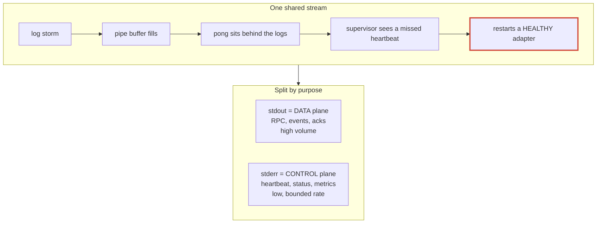
```mermaid
flowchart TB
    subgraph BADC["One shared stream"]
        X1["log storm"] --> X2["pipe buffer fills"]
        X2 --> X3["pong sits behind the logs"]
        X3 --> X4["supervisor sees a missed heartbeat"]
        X4 --> X5["restarts a HEALTHY adapter"]
    end
    subgraph GOODC["Split by purpose"]
        Y1["stdout = DATA plane<br/>RPC, events, acks<br/>high volume"]
        Y2["stderr = CONTROL plane<br/>heartbeat, status, metrics<br/>low, bounded rate"]
    end
    BADC --> GOODC
    style X5 stroke:#d24b3c,stroke-width:3px
```

Short answer: **the pipe is not the problem; the current framing and syscall pattern are.** But
stdio is still the wrong place for *high-volume* telemetry, and the fix is a split rather than a
faster pipe.

### 12.1 What is actually slow today

Anonymous pipes move data at GB/s. What costs you is per-message overhead, and the current
implementation maximizes it:

* **`Console.Error.WriteLine` per log line.** `Console.Out`/`Console.Error` are *synchronized*
  writers — a global lock per write — and autoflush, so every log line is a lock plus a syscall.
* **`.Replace("\n", "{{newline}}").Replace("\r", "")` on every line, on both sides.** Two to
  three string allocations per log, doubled because the host re-parses with `StartsWith` +
  `Replace`.
* **`BeginOutputReadLine` / `OutputDataReceived`** gives you an event and a fresh `string` per
  line, over a line-oriented reader, for every stream of every adapter. Fine for a handful of
  logs per invocation; not the model you want for fifteen long-lived processes.

All three are fixable without changing transport:

* Adapter side: grab `Console.OpenStandardOutput()` / `OpenStandardError()` **once** and write to
  the raw `Stream` via `PipeWriter`; never touch `Console.Out`/`Console.Error` again. Feed it
  from a bounded `Channel<Frame>` drained by a single writer task that **coalesces many frames
  per flush**. This turns one-syscall-per-log into one-syscall-per-batch.
* Host side: drop `BeginOutputReadLine` entirely; run one async `PipeReader` loop per stream over
  `process.StandardOutput.BaseStream`, parsing length-prefixed frames with zero intermediate
  strings.
* Logs go over the wire as **template + arguments**, not a formatted string, so formatting
  happens once, in the sink, and the log stays structured.

### 12.2 Two rules that matter more than throughput

**Logging must never apply backpressure to the data path.** The adapter's log channel must be
*bounded* with `DropOldest` and a `logs_dropped` counter. An adapter in an exception storm that
blocks on a full pipe — because the host is busy — has just deadlocked its own message
processing. This is the failure mode to design against, not raw MB/s.

**A log storm must not delay a heartbeat.** If logs and RPC share one stream, a burst of log
frames sits ahead of a `pong` in the pipe buffer, the supervisor sees a missed heartbeat, and it
restarts a perfectly healthy adapter. You already have two independent pipes with independent
kernel buffers, so use them for what they are good at:

* **stdout — data plane:** RPC requests/responses, pushed `event` frames, acks. High volume.
* **stderr — control plane:** heartbeat, status, metric snapshots, lifecycle and error events.
  Low, bounded rate, never starved by the data plane.

That also happens to preserve the existing convention, where stderr was already the log channel.

### 12.3 The split that actually resolves the question

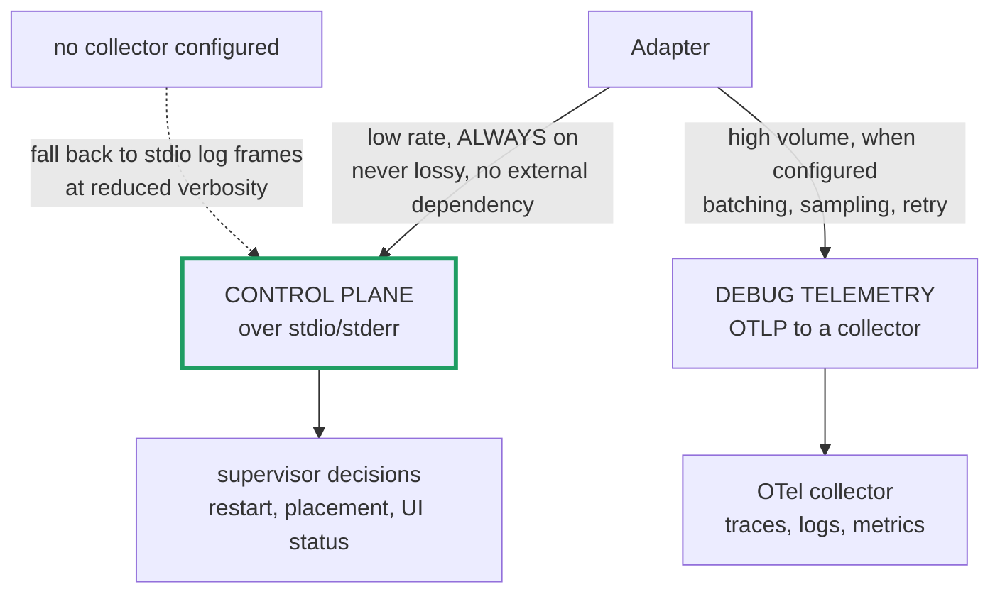
```mermaid
flowchart TB
    AD["Adapter"]
    AD -->|"low rate, ALWAYS on<br/>never lossy, no external dependency"| CP["CONTROL PLANE<br/>over stdio/stderr"]
    AD -->|"high volume, when configured<br/>batching, sampling, retry"| DP["DEBUG TELEMETRY<br/>OTLP to a collector"]
    CP --> SUP["supervisor decisions<br/>restart, placement, UI status"]
    DP --> COL["OTel collector<br/>traces, logs, metrics"]
    NOCOL["no collector configured"] -.->|"fall back to stdio log frames<br/>at reduced verbosity"| CP
    style CP stroke:#1f9d63,stroke-width:3px
```

*They have opposite requirements, so one channel cannot serve both. The supervisor's inputs must
never depend on external infrastructure being up; the human's inputs must never cost the host
CPU.*

Do not try to make one channel serve both the supervisor and the human. They have opposite
requirements.

| | Control-plane telemetry | Debug telemetry |
|---|---|---|
| Carries | heartbeat/status, metric snapshots (one frame every few seconds), errors, lifecycle, stderr ring buffer | per-message spans, debug logs, detailed metrics |
| Volume | bounded by construction | unbounded, bursty |
| Transport | **stdio (stderr), always on** | **OTLP to a collector, when configured** |
| Why | drives restart and placement decisions — must never be lossy, must never depend on external infrastructure being up | must never cost the host CPU, and needs batching/sampling/retry that is already solved |

The host already injects configuration at adapter startup, so it can inject
`OTEL_EXPORTER_OTLP_ENDPOINT` and the resource attributes (`service.name`, `adapter.id`,
`datasource.id`, `node.id`) with zero work from the adapter author. When no endpoint is
configured — a customer with no collector — the adapter falls back to stdio `log` frames at
reduced verbosity, and the `setLogLevel` control command turns detail on for one data source
when someone is actually debugging.

This also makes the polyglot story work: a Java Pulsar adapter or a Go MQTT adapter uses its own
OTel SDK and lands in the same traces, which would be very awkward if all telemetry had to be
tunnelled through a bespoke stdio frame format.

### 12.4 The data path, and the copy worth eliminating

For message payloads, stdio is not a bottleneck at Bitween's measured throughput — a pipe copy
is trivial next to the cloud-storage write that follows it. But note the payload is copied
adapter → host → cloud storage. For large payloads it is worth letting the adapter write
directly to cloud storage and send only a reference in the `event` frame, above a size
threshold. That removes the largest copy and the host CPU with it, at the cost of giving the
adapter storage credentials — or, better, having the host hand out pre-issued upload URLs. Treat
this as an optimization to enable later, not a day-one requirement.

### 12.5 Measure before committing

Before building on any of this, benchmark the v2 framing standalone: frames/second and
µs/frame for small control frames, allocations per frame on both sides, and host CPU at
*N* adapters × *M* messages/sec. It is a day of work and it decides whether the batching design
above is sufficient or whether the data plane needs a different transport.

---

## 13. Revision: orchestrated adapters, and why this changes the protocol choice

> **This section revises §2, §3, §8 and parts of §11.** The third mode is not
> "`docker run` on the Bitween host" — it is Bitween driving the **Kubernetes API** to deploy a
> separate application that Bitween talks to over the network. That is a materially better idea,
> and it removes the reason for the bespoke stdio framing proposed in §3.

### 13.1 The three modes, restated

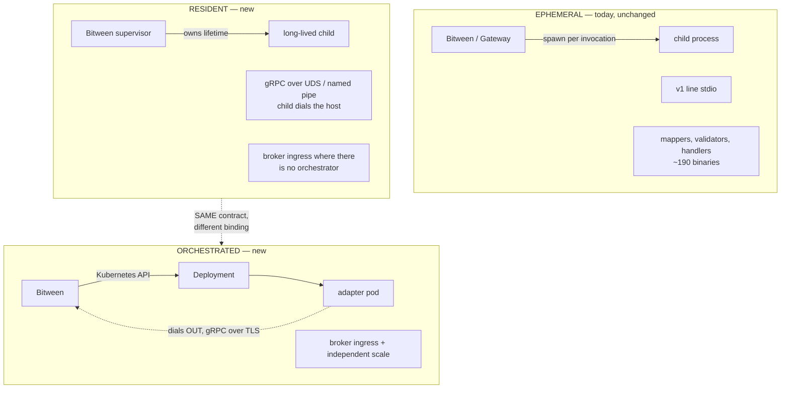
```mermaid
flowchart TB
    subgraph M1["EPHEMERAL — today, unchanged"]
        E1["Bitween / Gateway"] -->|"spawn per invocation"| E2["child process"]
        E3["v1 line stdio"]
        E4["mappers, validators, handlers<br/>~190 binaries"]
    end
    subgraph M2["RESIDENT — new"]
        R1["Bitween supervisor"] -->|"owns lifetime"| R2["long-lived child"]
        R3["gRPC over UDS / named pipe<br/>child dials the host"]
        R4["broker ingress where there<br/>is no orchestrator"]
    end
    subgraph M3["ORCHESTRATED — new"]
        O1["Bitween"] -->|"Kubernetes API"| O2["Deployment"]
        O2 --> O3["adapter pod"]
        O3 -.->|"dials OUT, gRPC over TLS"| O1
        O4["broker ingress + independent scale"]
    end
    M2 -.->|"SAME contract,<br/>different binding"| M3
```

*Resident and Orchestrated are one adapter with two bindings. Ephemeral keeps its own path
because a per-invocation spawn cannot afford gRPC startup — and because ~190 binaries depend on
it being frozen.*

| Mode | Lifetime owned by | Transport | Fits |
|---|---|---|---|
| **Ephemeral** (today) | Bitween, per invocation | v1 line stdio, **unchanged** | mappers, validators, handlers — short, CPU-bound, thousands of spawns |
| **Resident** | Bitween supervisor | gRPC over UDS / named pipe | broker connections where there is no orchestrator |
| **Orchestrated** | Kubernetes | gRPC over TCP+TLS | broker connections and anything needing independent scale |

Resident and Orchestrated are **the same adapter with a different binding**. Ephemeral stays on
its own path because per-Xchange process spawn cannot afford a gRPC stack, and because the
existing adapter fleet must keep working untouched.

### 13.2 Two planes, not one

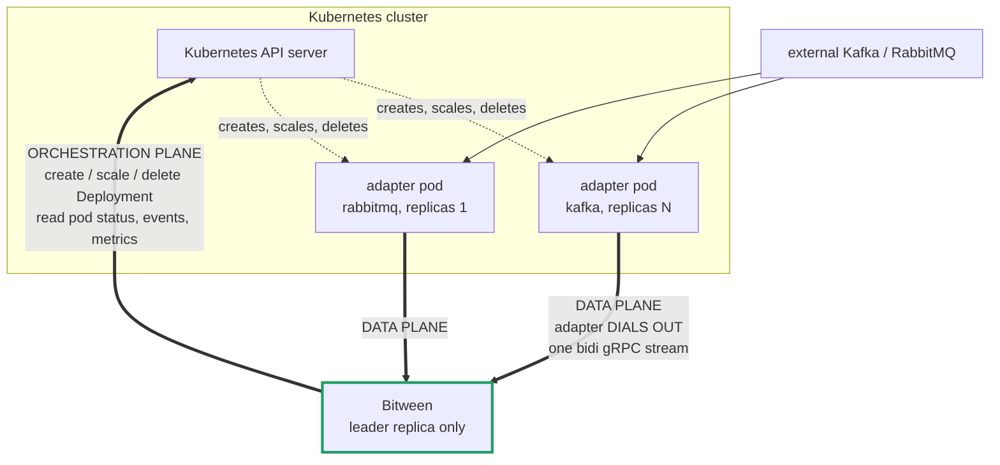
```mermaid
flowchart TB
    subgraph K8S["Kubernetes cluster"]
        API["Kubernetes API server"]
        POD1["adapter pod<br/>kafka, replicas N"]
        POD2["adapter pod<br/>rabbitmq, replicas 1"]
        API -.creates, scales, deletes.-> POD1
        API -.creates, scales, deletes.-> POD2
    end
    BW["Bitween<br/>leader replica only"]
    BW ==>|"ORCHESTRATION PLANE<br/>create / scale / delete Deployment<br/>read pod status, events, metrics"| API
    POD1 ==>|"DATA PLANE<br/>adapter DIALS OUT<br/>one bidi gRPC stream"| BW
    POD2 ==>|"DATA PLANE"| BW
    BROKER["external Kafka / RabbitMQ"] --> POD1
    BROKER --> POD2
    style BW stroke:#1f9d63,stroke-width:3px
```

*Dial-**out** is the decision that makes everything else fall into place — no Service, no
Ingress, no TLS cert or DNS name for the adapter, no service discovery, works through NAT and
egress-only NetworkPolicy, one auth direction instead of two. And the stream is symmetric,
exactly like the pipe was.*

---

### Why dial-in would have been worse

```mermaid
flowchart LR
    subgraph IN["Bitween dials the adapter"]
        I1["needs a Service + DNS name"]
        I2["needs TLS cert for the adapter"]
        I3["needs service discovery"]
        I4["adapter must authenticate Bitween"]
        I5["and for PUSH the adapter<br/>must dial back anyway"]
        I5 --> I6["two connection directions,<br/>two auth setups"]
    end
    subgraph OUT["Adapter dials Bitween"]
        U1["Deployment only, no Service"]
        U2["one stream, symmetric"]
        U3["one token, mounted by the pod"]
    end
    IN --> OUT
    style I6 stroke:#d24b3c,stroke-width:3px
```

The orchestrated mode splits into two independent directions, and conflating them is the main
way this design goes wrong:

* **Orchestration plane — Bitween → Kubernetes API.** Create / update / scale / delete the
  adapter's `Deployment`, read pod status, events, and metrics. This replaces "spawn a process."
* **Data plane — adapter pod → Bitween.** The adapter **dials out** to Bitween and opens one
  long-lived bidirectional gRPC stream. This replaces "the pipes."

Making the adapter dial *out* rather than Bitween dial *in* is the decision that makes everything
else fall into place:

* No `Service`, no `Ingress`, no TLS certificate, no DNS name for the adapter.
* No service discovery — Bitween never needs to find the adapter.
* Works through NAT and restrictive `NetworkPolicy` egress-only setups.
* One authentication direction instead of two (the adapter presents a token; the pod got it from
  a mounted secret Bitween wrote when it created the Deployment).
* **The stream is symmetric, exactly like the pipe was.** Host→adapter commands and
  adapter→host events multiplex over it, and the push/ack path from §5 works identically.

The cost to be explicit about: Bitween must expose a gRPC endpoint the pods can reach. In-cluster
that is trivial; if Bitween runs outside the cluster it must be publicly reachable, which is a
real deployment constraint and belongs in the prerequisites.

### 13.3 This removes the need for protocol v2 framed stdio

```mermaid
flowchart LR
    subgraph HAND["Hand-built framing — sec 3"]
        H1["custom length prefix"]
        H2["custom message ids"]
        H3["custom credit protocol"]
        H4["custom frame types"]
        H5["ad-hoc versioning"]
        H6["a codec per language"]
        H7["custom log/metric frames"]
    end
    subgraph GRPC["gRPC — free"]
        G1["bytes"]
        G2["HTTP/2 streams"]
        G3["HTTP/2 flow control"]
        G4["bidi streaming"]
        G5["proto field numbers"]
        G6["protoc"]
        G7["interceptors + OTel"]
    end
    H1 --> G1
    H2 --> G2
    H3 --> G3
    H4 --> G4
    H5 --> G5
    H6 --> G6
    H7 --> G7
    style GRPC stroke:#1f9d63,stroke-width:3px
```

*One transport abstraction, two bindings:*

```mermaid
flowchart TB
    PROTO["ONE .proto envelope contract"]
    PROTO --> B1["Resident binding<br/>UDS on Linux/macOS<br/>named pipe on Windows"]
    PROTO --> B2["Orchestrated binding<br/>TCP + TLS"]
    B1 --> C1["child dials the host"]
    B2 --> C2["pod dials the host"]
    C1 --> SAME["IDENTICAL code path<br/>above the transport"]
    C2 --> SAME
    style SAME stroke:#1f9d63,stroke-width:3px
```

§3 argued for a hand-built length-prefixed framed protocol. Once the orchestrated mode is in
scope, that is over-engineering. Define the contract **once as a `.proto` service** and gRPC
supplies, for free, every property §3 was hand-rolling:

| §3 requirement | Hand-built framing | gRPC |
|---|---|---|
| Binary payloads | custom body segment | `bytes` |
| Multiplexing, message ids | custom id/correlation | HTTP/2 streams |
| Credit-based flow control | custom credit protocol | HTTP/2 flow control |
| Bidirectional, symmetric | custom frame types | bidi streaming |
| Contract versioning | ad-hoc | proto field numbers |
| Polyglot adapters | write a codec per language | `protoc` |
| Tracing, metrics, logging | custom `log`/`metric` frames | interceptors + first-class OTel instrumentation |

That is a large amount of design, test, benchmark and version work removed — and §12.5's
"benchmark the framing first" becomes unnecessary.

For **Resident** (no orchestrator), use the same gRPC contract over a **Unix domain socket** on
Linux/macOS and a **named pipe** on Windows — both are supported transports for Kestrel and
`Grpc.Net.Client` on .NET 8. The host creates the endpoint, passes its path plus a one-time
token to the child, and the child dials in. **Identical dial-out shape to the orchestrated mode,
so resident and orchestrated share the entire code path above the transport.**

The one thing to keep from §12: **stdio still carries early-life diagnostics** — everything the
adapter logs before it manages to dial, and its crash output. Keep the stderr ring buffer.

Ephemeral adapters keep the v1 line protocol verbatim. The §3 bugs still need fixing (secrets on
`argv`, the EOF hot-spin), because they are live today.

### 13.4 What orchestrated mode genuinely buys, beyond packaging

* **Independent scale-out.** A Kafka adapter for a 60-partition topic can run six replicas in one
  consumer group. Neither the resident nor the in-proc plugin model can do that at all — they are
  capped at one connection owner per data source. This is the largest single win and it did not
  exist in the earlier design.
* **The node-pressure problem disappears.** Broker connections and librdkafka's native buffers
  never live on a Bitween node. All of §11 collapses to `resources.limits.memory` — a declarative
  field, kernel-enforced, zero code.
* **Better health data than a child process gives you.** Pod status, `OOMKilled` as an explicit
  reason rather than an inference, `CrashLoopBackOff`, restart counts, pod events, and
  CPU/memory from `metrics.k8s.io`.
* **Independent rollout.** Upgrade one provider without touching the Bitween deployment.
* **Polyglot for real** — a Java Pulsar client or a Go MQTT client is just another image.

### 13.5 What it costs — stated plainly

* **A second operational model, permanently.** Non-k8s customers get Resident; k8s customers get
  Orchestrated. Two health models, two log paths, two failure taxonomies, two sets of UI states.
  This is the biggest cost and it does not go away. It is only tolerable because both modes share
  one contract and one data plane.
* **RBAC.** Bitween needs a ServiceAccount with create/update/delete on Deployments. Many
  enterprises will push back. Mitigate with a namespace-scoped `Role` in a dedicated namespace —
  never cluster-wide — and make the whole thing opt-in.
* **Runtime install gets weaker, not stronger.** This is the important counterpoint. Resident
  adapters install from a zip in cloud storage — Bitween fully controls it. Orchestrated adapters
  are **images in a registry**, so runtime install now depends on the *customer's* registry,
  pull secrets, air-gap policy, image scanning, and admission controllers that may reject
  unsigned images. The "install a provider without a redeploy" property survives, but it stops
  being purely Bitween's to guarantee.
* **You are writing a Kubernetes controller.** Imperatively creating and deleting Deployments
  from a web application drifts. The idiomatic answer is a CRD plus an operator, which needs
  cluster-admin to install CRDs. Pragmatic middle ground: manage plain Deployments labelled
  `bitween.io/datasource-id`, and reconcile by listing labelled Deployments rather than by
  remembering what you created. No CRD, namespace-scoped RBAC, drift still self-corrects.
* **Cold start.** Deploy → pull image → schedule → start → dial back is seconds to minutes. "Test
  connection" against a not-yet-deployed adapter is therefore awkward; either run it as a
  short-lived `Job`, or keep one warm generic adapter pod per provider type for
  test/describe/discover calls.
* **Local dev and integration testing get harder.** Testcontainers cannot hand you a cluster; you
  need k3s or kind in CI. Given that the integration suite does not run in CI at all today, this
  is a real concern rather than a theoretical one. Mitigation: make the Kubernetes orchestrator a
  thin, mockable `IAdapterOrchestrator`, and test adapter *behaviour* in Resident mode — which is
  the same code — so only the orchestrator itself needs a cluster.

### 13.6 Exclusivity is *not* free, and this is a trap

```mermaid
sequenceDiagram
    autonumber
    participant D as Deployment replicas=1
    participant P1 as Pod v1 old config
    participant P2 as Pod v2 new config
    participant B as Broker
    Note over D: someone edits the DataSource config
    D->>P2: create new pod
    Note over P1,P2: RollingUpdate keeps the old pod<br/>until the new one is Ready
    P1->>B: still consuming
    P2->>B: also consuming
    Note over B: DUPLICATE CONSUMPTION WINDOW<br/>on every single config change
    D->>P1: terminate old pod
    P1->>B: stops
```

*Fix: `strategy: Recreate` for exclusive consumers, or a StatefulSet where at-most-one really
matters. Better still, where the broker coordinates (Kafka consumer groups, RabbitMQ competing
consumers), run `replicas: N` and drop the exclusivity requirement — that is the whole point of
the mode.*

```mermaid
flowchart LR
    Q{"does the provider<br/>coordinate consumers?"}
    Q -->|"yes — Kafka groups,<br/>RabbitMQ competing consumers"| A["replicas: N<br/>no exclusivity needed<br/>SCALE OUT"]
    Q -->|"no — exclusive consumer"| B{"how strict?"}
    B -->|"tolerable overlap"| C["Deployment<br/>strategy: Recreate"]
    B -->|"must be at-most-one"| D["StatefulSet"]
    style A stroke:#1f9d63,stroke-width:3px
```

The resident model relied on Bitween's leader election to guarantee exactly one consumer per data
source. It is tempting to assume `replicas: 1` replaces that. It does not:

* A `Deployment` with the default `RollingUpdate` strategy runs **two pods simultaneously**
  during every rollout. For an exclusive consumer that is a duplicate-consumption window on every
  config change.
* During a node partition, a Deployment can transiently exceed its replica count.

So: use `strategy: Recreate` for exclusive consumers, and prefer a **StatefulSet** where
at-most-one really matters — its at-most-one-per-ordinal guarantee is far stronger than a
Deployment's. Where the provider supports it (Kafka consumer groups, RabbitMQ competing
consumers), prefer `replicas: N` with broker-side coordination and drop the exclusivity
requirement entirely — that is the whole point of §13.4.

And Bitween's own leader election still matters, for a different reason: **exactly one Bitween
replica may drive the Kubernetes API**, or concurrent replicas will fight over the same
Deployments.

### 13.7 Revised sequencing

| Phase | Work | Note |
|---|---|---|
| **0** | Fix `argv` secret exposure and the EOF hot-spin in the v1 path | Live bugs, independent of everything else |
| **1** | Define the adapter contract as `.proto` — one service, bidi stream, host and adapter commands | The single most important artifact; everything binds to it |
| **2** | Resident mode: gRPC over UDS / named pipe, adapter dials host, `IResidentAdapterHost` + supervisor + §11 limits | Ships value without any orchestrator |
| **3** | RabbitMQ resident adapter | First real provider; §11 limits and §12 telemetry get exercised |
| **4** | `IAdapterOrchestrator` + `SW.Serverless.Kubernetes` — optional package, namespace-scoped RBAC, labelled Deployments, warm pod for describe/test | Same contract, second binding. Non-k8s customers never load it |
| **5** | Kafka adapter, running orchestrated with `replicas: N` in a consumer group | The case that justifies the whole orchestrated mode |

Phase 1 is the hinge. If the contract is defined properly once, phases 2 and 4 are two bindings
of the same thing rather than two subsystems.

---

## 14. Revision: SW-Serverless is a shared library, not a Bitween subsystem

> **This section revises §2, §3, §4 and §13.7.** Evidence: `Traxis/Adapters/Agent` (~107 adapter
> projects), `Traxis/Adapters/Bitween` (~80 more), and `Traxis/Microservices/Gateway`, cross-read
> against `Adapters/Agent/SERVERLESS_ADAPTERS.md`.

### 14.1 The constraint that dominates everything else

```mermaid
flowchart TB
    subgraph FLEET["The installed base"]
        F1["~107 Traxis Agent adapters<br/>one exe per carrier x command"]
        F2["~80 Traxis Bitween adapters<br/>mappers, handlers, receivers"]
        F3["SDK versions in live use<br/>2.0.16 / 2.0.22 / 5.0.5<br/>6.0.0 / 6.0.9 / 6.0.28<br/>8.0.1 / 8.1.1 / 8.1.2"]
        F4["Host versions in live use<br/>6.0.9 / 6.0.28<br/>8.1.1 / 8.1.2 / 8.1.5"]
    end
    FLEET --> RULE["RULE<br/>every change is additive and opt-in,<br/>selected PER ADAPTER via metadata,<br/>never per host"]
    RULE --> R1["absent Protocol key<br/>= v1 code path, byte for byte"]
    style RULE stroke:#1f9d63,stroke-width:3px
```

---

### The Dockerfile line that proves the model is straining

```mermaid
flowchart LR
    IMG["Gateway image<br/>FROM aspnet:8.0"]
    COPY["COPY --from=aspnet:6.0<br/>/usr/share/dotnet/shared"]
    IMG --> COPY
    COPY --> WHY["because the adapter fleet<br/>multi-targets net6 AND net8"]
    WHY --> PROB["every adapter's target framework<br/>is the HOST IMAGE's problem,<br/>forever and cumulatively"]
    PROB --> FIX["Orchestrated mode dissolves this —<br/>each adapter image carries<br/>its own runtime"]
    style PROB stroke:#d24b3c,stroke-width:3px
    style FIX stroke:#1f9d63,stroke-width:3px
```

| Fact | Consequence |
|---|---|
| ~107 Traxis **Agent** adapter executables (one per carrier × command) plus ~80 Traxis **Bitween** adapters | Roughly 190 published binaries sitting in S3 as the installed base |
| `SimplyWorks.Serverless.Sdk` versions in live use: **2.0.16, 2.0.22, 5.0.5, 6.0.0, 6.0.9, 6.0.28, 8.0.1, 8.1.1, 8.1.2** | The fleet spans four major versions. Some of these adapters likely cannot be rebuilt cheaply |
| Host `SimplyWorks.Serverless` versions in use: **6.0.9, 6.0.28, 8.1.1, 8.1.2, 8.1.5** | Two independent products upgrade on independent cadences |
| Gateway's `Dockerfile` does `COPY --from=mcr.microsoft.com/dotnet/aspnet:6.0 /usr/share/dotnet/shared` into an `aspnet:8.0` image | **The host image already ships two .NET runtimes because the adapter fleet multi-targets.** This is a live workaround for a real problem |

**Rule that follows: every change to SW-Serverless must be additive and opt-in, selected
per-adapter, never per-host.** The "absent `Protocol` metadata ⇒ v1 verbatim" rule from §2 is not
a courtesy; it is the only thing that keeps ~190 binaries alive. And "ephemeral is the legacy
path" was wrong — **ephemeral is the primary product**, with the bulk of the installed base and
the highest invocation rate. It must be treated as first-class and frozen, not tolerated.

### 14.2 The multi-runtime problem is a genuine, existing win for orchestrated mode

The `COPY --from=aspnet:6.0` line is the clearest evidence in the repository that the current
model is straining. A single host process can only offer the runtimes baked into its image, so
every adapter's target framework becomes the host image's problem, forever, cumulatively.

**Orchestrated mode dissolves this**: each adapter image carries its own runtime. So does the
container launcher. This is a concrete, present-day pain — not a speculative future benefit —
and it raises the value of §13 beyond what I credited it with.

It is also an argument for the `Executable` metadata key from §11.1 even in the local process
launcher: an adapter published self-contained or ReadyToRun stops depending on the host image's
runtime set entirely.

### 14.3 Fixes that pay for themselves before any of this design lands

Three defects are live in Traxis production today, all fixable **host-side only, with zero
adapter changes**, benefiting ~190 existing binaries:

1. **The un-correlated `TaskCompletionSource`.** §3 listed this as a blocker for resident
   adapters. It is not theoretical — it is a documented production hazard: `CommandTimeout`
   fires `TrySetException` but **does not kill the child**, so the timed-out command's late
   result line resolves the *next* invocation's TCS. Because Gateway calls `GetLogs` immediately
   after every command, that stray result normally lands on and corrupts the log fetch.
   Fix: a FIFO queue of pending completions instead of one field, **and kill the child on
   `CommandTimeout`** — after a timeout the process state is unknown and reusing it is unsafe.
2. **`IdleTimeout` kills the whole process, not the pending command** (300s default, adapter-side,
   thrown from a timer callback). Fine for ephemeral, fatal for resident — it must become opt-out
   via metadata.
3. **`Install` never deletes superseded `{ETag}` directories** — roughly 7 MB per version per
   pod, accumulating forever. Harmless-ish with short-lived pods; a real leak once adapters are
   resident or pods are long-lived.

Plus the two from §3 that this evidence confirms are not hypothetical: **`agent.Settings` is
carrier credentials, and it rides to every adapter as base64 on `argv`**, readable via `ps` — and
the same settings are written unredacted into the S3 audit JSON, masked only at read time by a
substring heuristic.

This reorders the business case. I framed protocol work as a cost to be paid for the bus feature.
Item 1 alone is a Traxis production bug fix that happens to also unblock Bitween.

### 14.4 Process reuse already exists — resident is a smaller step than stated

§4 described the jump from "one process per invocation" to "long-lived process" as the big
change. It is smaller than that, because the current model is already **one process per
*session*, not per *command***:

* Gateway issues **two** `InvokeAsync` calls per logical operation — the command, then `GetLogs`
  in a `finally`.
* Multipiece shipments call `CreateShipment` **once per piece, sequentially, against the same
  already-started child**.

So adapters already tolerate multiple commands over one process lifetime, and the host already
manages a session. Resident mode extends the session's lifetime and adds the push direction; it
does not introduce process reuse.

### 14.5 A third resident shape: pooled workers

```mermaid
flowchart TB
    subgraph EX["EXCLUSIVE resident — brokers"]
        E1["exactly 1 instance"]
        E2["owns a connection, holds state"]
        E3["PUSHES events to the host"]
        E4["keyed by DataSourceId"]
        E5["guarded by leader election"]
    end
    subgraph PO["POOLED resident — stateless workers"]
        P1["N warm instances"]
        P2["no connection state"]
        P3["host always initiates"]
        P4["keyed by adapterId"]
        P5["checkout / checkin per invocation"]
    end
```

*Pooled resident has nothing to do with brokers — it is a latency win for Traxis and Bitween
alike, removing process spawn + JIT + an S3 metadata check from every request.*

---

### Why pooling cannot simply be switched on

```mermaid
sequenceDiagram
    autonumber
    participant R1 as Request A
    participant P as Pooled adapter process
    participant R2 as Request B
    R1->>P: CreateShipment
    Note over P: HttpClientWithLog appends to<br/>the PROCESS-STATIC LogStore
    R1->>P: GetLogs
    P-->>R1: logs for A
    Note over P: LogStore is NEVER cleared —<br/>multipiece relies on accumulation
    R2->>P: CreateShipment (checked out again)
    R2->>P: GetLogs
    P-->>R2: logs for A **and** B
    Note over R2: request A's carrier audit trail<br/>leaks into request B's S3 log
```

*So pooling needs `Poolable=true` opt-in, an explicit session boundary (a `Reset` command, or
scoping `LogStore` to a session id), and the FIFO plus kill-on-timeout fix first — otherwise one
timeout poisons every subsequent checkout rather than one call.*

§4 assumed one resident instance per `DataSource`. Traxis reveals a second, equally valuable
shape that has nothing to do with brokers:

| Shape | Instances | State | Push? | Keyed by | Use |
|---|---|---|---|---|---|
| **Exclusive resident** | exactly 1 | owns a connection | yes | `DataSourceId` | broker ingress |
| **Pooled resident** | N warm | stateless | no | `adapterId` | replaces per-invocation spawn |

Pooled resident is a drop-in latency win for both products: Gateway currently pays
`dotnet` process spawn + JIT + an S3 metadata check on every tracking request and every shipment
creation, and Bitween pays it per Xchange stage. A warm pool with checkout/checkin removes that
from the request path with no change to adapter *logic*.

**But it cannot be turned on blindly, and the reason is instructive.** `AdapterBase`'s `LogStore`
is **process-static**, deliberately: `GetLogs` returns everything accumulated since the process
started, and multipiece relies on that accumulation across calls. Pool the process and you leak
one request's HTTP audit trail into the next one's S3 log. So pooling requires:

* opt-in via metadata (`Poolable=true`), never a default;
* an explicit session boundary — a `Reset` command, or scoping `LogStore` to a session id — so
  "per process" stops being the unit of accumulation;
* the FIFO/kill-on-timeout fix from §14.3 first, because a pooled process that survives a timeout
  in unknown state would poison every subsequent checkout rather than one.

This changes §4: `IResidentAdapterHost` needs **pool semantics** (min/max instances, checkout,
idle eviction, max-invocations-before-recycle), not just a dictionary of singletons.

### 14.6 The `.proto` must be a generic envelope, not a domain contract

```mermaid
flowchart TB
    subgraph HOSTS["Host SDKs own the DOMAIN"]
        T["SimplyWorks.TraxisGateway.Sdk<br/>Track, CreateShipment, DeleteShipment,<br/>GetPudoCode, GetPod, GetLogs"]
        B["SW.Bitween.Sdk<br/>mapper, handler,<br/>receiver, validator"]
    end
    subgraph SL["SW-Serverless owns the ENVELOPE only"]
        E["Invoke(command, bytes) -> Result(bytes)<br/>Event(bytes, correlationId, traceparent) -> Ack<br/>Log / Metric / Ping / Pong<br/>SetLogLevel / Describe / Reset"]
    end
    T -->|"serialises its own types<br/>into opaque bytes"| E
    B -->|"serialises its own types<br/>into opaque bytes"| E
    E --> W["transport, lifecycle, installation<br/>NEVER learns a domain type"]
    style W stroke:#1f9d63,stroke-width:3px
```

*If the proto grew `rpc Track(...)`, Traxis's five commands and Bitween's four adapter roles
would land in one file, and every host would be coupled to every other host's domain.*

§13.3 said "define the contract once as a `.proto`." With two hosts in view, be precise about
*which* contract. Traxis Gateway's command names (`Track`, `CreateShipment`, `DeleteShipment`,
`GetPudoCode`, `GetPod`, `GetLogs`) and its payload types (`TrackableShipment`,
`StandardShipmentTrace`, `ShipmentCreationResult`) live in **Gateway's own SDK NuGet**
(`SimplyWorks.TraxisGateway.Sdk`) — not in SW-Serverless. Bitween's mapper/handler/receiver/
validator contracts live in Bitween's SDK. That separation is correct and must survive.

So the proto defines the **envelope only**:

```
Invoke(command: string, payload: bytes) -> Result(payload: bytes | error)
Event(payload: bytes, correlationId, traceparent) -> Ack | Nack
Log / Metric / Ping / Pong / SetLogLevel / Describe / Reset
```

Opaque `bytes`, with serialization owned by the host SDK. SW-Serverless stays what it already
is — **transport, lifecycle and installation** — and never learns a domain type. If the proto
grew `rpc Track(...)`, Traxis's five commands and Bitween's four adapter roles would end up in
one file, and every host would be coupled to every other host's domain.

This also resolves something §13 left implicit: the reason `{{expected}}` / `Runner.Expect`
exists and is plumbed but unused on Gateway's hot path is that it is *administrative* metadata,
not part of the invocation contract. `Describe` is its successor and belongs in the envelope.

### 14.7 Revised sequencing

```mermaid
flowchart TB
    P0["PHASE 0 — bug fixes, host-side only<br/>FIFO completions + kill-on-timeout<br/>IdleTimeout opt-out<br/>ETag directory cleanup<br/>secrets off argv, EOF spin"]
    P1["PHASE 1 — .proto envelope<br/>per-adapter opt-in via metadata<br/>v1 path untouched"]
    P2["PHASE 2 — resident host<br/>BOTH shapes: pooled + exclusive<br/>gRPC over UDS / named pipe"]
    P3["PHASE 3 — RabbitMQ<br/>exclusive-resident adapter"]
    P4["PHASE 4 — IAdapterOrchestrator<br/>SW.Serverless.Kubernetes<br/>per-adapter runtime images"]
    P5["PHASE 5 — Kafka adapter<br/>orchestrated, replicas N<br/>in a consumer group"]
    P0 --> P1 --> P2 --> P3
    P2 --> P4 --> P5
    P0 -.->|"ships value ALONE<br/>to ~190 adapters<br/>with no adapter changes"| V0["TRAXIS TODAY"]
    P2 -.-> V2["Traxis latency<br/>+ Bitween brokers"]
    P4 -.-> V4["Bitween brokers<br/>+ retires Gateway's<br/>dual-runtime image hack"]
    style P0 stroke:#1f9d63,stroke-width:3px
    style V0 stroke:#1f9d63,stroke-width:3px
    style P1 stroke:#cf9a2e,stroke-width:3px
```

*Phase 0 ships value on its own, to the product with the larger installed base, before any
architectural commitment. Phase 1 is the hinge — get the envelope right once and phases 2 and 4
are two bindings of one thing rather than two subsystems.*

| Phase | Work | Who benefits |
|---|---|---|
| **0** | FIFO pending-completions + kill-on-`CommandTimeout`; `IdleTimeout` opt-out; `{ETag}` directory cleanup; secrets off `argv`; EOF hot-spin | **Traxis today**, ~190 adapters, no adapter changes |
| **1** | `.proto` envelope + per-adapter opt-in via metadata; v1 path untouched | Foundation |
| **2** | Resident host with **both** shapes — pooled and exclusive — over gRPC on UDS / named pipe | Traxis latency **and** Bitween brokers |
| **3** | RabbitMQ exclusive-resident adapter | Bitween |
| **4** | `IAdapterOrchestrator` + `SW.Serverless.Kubernetes`; per-adapter runtime images | Bitween brokers **and** retires Gateway's dual-runtime image hack |
| **5** | Kafka adapter, orchestrated, `replicas: N` in a consumer group | Bitween |

Phase 0 now ships value on its own, to the product with the larger installed base, before any
architectural commitment is made. That is a much better position to start from than "build a
protocol, then a supervisor, then finally something a customer notices."

### 14.8 Governance

Per the existing note that `SimplyWorks.*` are public Simplify9 repositories with CI/CD
auto-publish: changes land as PRs and publish automatically. With two products pinned to
different versions, the operating rule is **version the behaviour, not the library** — new
capability behind metadata flags and new APIs, so Gateway can take a NuGet bump with zero
behavioural change and adopt features on its own schedule. A breaking protocol change would
require a coordinated upgrade across ~190 binaries and is effectively off the table.

---

## 15. What "gRPC over UDS / named pipe" actually means

> **Clarifies §3.1 and §13.3.** Those two sections look contradictory — §3.1 rejects gRPC to keep
> stdio's simplicity, §13.3 adopts gRPC. They are talking about different transports. This
> section closes the gap and walks through what changes inside an S3-zipped adapter.

### 15.1 The apparent contradiction, resolved

§3.1 said gRPC "buys better tooling and costs all of that back." That judgement was about
**gRPC over localhost TCP** — and it still stands. A UDS is not a network socket.

A **Unix domain socket (UDS)** uses the socket *API* but is a **filesystem path**, not an address:
`/run/bitween/adapters/a1b2c3.sock`. There is no IP, no port, no network stack, no routing. The
kernel moves the bytes between two processes on the same machine, and access is controlled by
ordinary filesystem permissions. It is the same *category* of object as a pipe — it just happens
to be full-duplex and to carry many concurrent streams.

On Windows the equivalent is a **named pipe**: `\\.\pipe\bitween-adapter-a1b2c3`, a kernel IPC
object secured by an ACL. .NET 8 gave Kestrel first-class named-pipe support, so this is a
supported transport, not a hack.

| | stdio pipes | **UDS / named pipe** | localhost TCP |
|---|---|---|---|
| Port allocation / collisions | none | **none** | yes |
| Bind address, firewall rule | none | **none** | yes |
| Reachable from another machine | no | **no** | possible — one `0.0.0.0` mistake away |
| Access control | inherited handles | **filesystem perms / ACL** | needs an auth token |
| Many concurrent streams | **no** — 2 half-duplex pipes | **yes** | yes |
| Binary-safe | needs custom framing | **yes** | yes |
| Crosses a container boundary | yes, `docker run -i` | **only via a mounted volume** | yes |

So "gRPC over UDS" means: keep protobuf messages, bidirectional streams, HTTP/2 flow control,
interceptors and codegen — and run the whole thing over an IPC object with **no port, no bind
address, no firewall rule and no network exposure**. Every property §3.1 was protecting survives.

The one genuine loss is the last row: stdio crosses a container boundary for free, a UDS needs a
shared mount (`-v /run/bitween:/run/bitween`, or an `emptyDir` in a pod). That is a real cost and
the reason it is called out here rather than glossed over.

```mermaid
flowchart TB
    subgraph A["stdio pipes — today"]
        A1["2 half-duplex byte streams"]
        A2["no ports, no firewall"]
        A3["ONE call in flight<br/>framing is yours to build"]
    end
    subgraph B["UDS / named pipe — proposed"]
        B1["full-duplex kernel IPC<br/>a filesystem path, not an address"]
        B2["no ports, no firewall"]
        B3["HTTP/2 multiplexing, flow control,<br/>binary, codegen — all free"]
    end
    subgraph C["localhost TCP — rejected in sec 3.1"]
        C1["real network socket"]
        C2["port allocation, bind address,<br/>firewall, auth token"]
        C3["same gRPC benefits"]
    end
    A -->|"keeps the simplicity,<br/>gains the plumbing"| B
    C -->|"gains the plumbing,<br/>LOSES the simplicity"| B
    style B stroke:#1f9d63,stroke-width:3px
    style C stroke:#d24b3c,stroke-width:3px
```

### 15.2 What changes inside an S3-zipped adapter — nothing about the zip

This is the practical question, and the answer is reassuring: **installation, packaging and
distribution are untouched.**

The zip is still the published output of a .NET console app. `GetAdapterMetadata` still reads
`EntryAssembly` and `Hash` from S3 object metadata; `Install` still extracts to
`{AdapterLocalPath}/{Hash}/`; the host still spawns `dotnet <EntryAssembly>`. The **only**
difference is what the SDK does once `Main` runs:

```csharp
// Ephemeral adapter — today, unchanged, still the v1 stdin line loop
static Task Main() => Runner.Run(new Handler());

// Resident adapter — same zip, same spawn, different SDK entry point
static Task Main() => Runner.RunResident(new Handler());
```

Packaging cost: `Grpc.Net.Client` + `Google.Protobuf` become transitive dependencies of the SDK,
adding roughly 2–3 MB to that adapter's published output. It is **opt-in per adapter** — an
adapter that is never rebuilt against the new SDK never gains the dependency and never leaves the
v1 path. That is what protects the ~190 existing binaries (§14.1).

### 15.3 The handshake, step by step

```mermaid
sequenceDiagram
    autonumber
    participant H as Bitween host
    participant FS as socket path or pipe name
    participant P as Adapter child process
    H->>FS: Kestrel listens on /run/bitween/adapters.sock
    Note over FS: directory is chmod 0700, owned by the service user<br/>Windows equivalent is an ACL restricted to the current user
    H->>P: spawn dotnet Adapter.dll  (NO secrets on argv)
    H->>P: write ONE handshake line to stdin<br/>socket path, one-time token, protocol version
    P->>FS: open a Unix socket and connect
    P->>H: Attach RPC carrying the token
    H->>H: match token to the pending spawn, bind the instance
    Note over H,P: one bidirectional stream is now open
    H->>P: Invoke, Ping, SetLogLevel, Reset
    P->>H: Event, Log, Metric, Pong
    Note over H,P: both directions multiplex over the SAME stream
```

Three details worth noticing:

* **The child dials the host, not the reverse.** The host is already running and already
  listening; the child is transient. It also means the child never picks a path, never handles a
  bind failure, and — critically — this is the **identical shape as the Kubernetes case**, where a
  pod dials out (§13.2). One code path above the transport.
* **The handshake goes over stdin, not `argv`.** The socket path is not secret but the token is,
  and this is the same mechanism that fixes the `argv` credential leak in §14.3. No new
  machinery: the child already has a stdin pipe.
* **stdio does not disappear.** It keeps carrying what it is genuinely good at — anything the
  adapter logs *before* it manages to attach, and its crash output. That is the ring buffer in
  §6.7.

### 15.4 The wiring, concretely

Nothing exotic; both sides are supported .NET APIs.

**Host — listen on the socket** (`SW.Serverless`, once at startup, one listener for all adapters):

```csharp
// Linux / macOS
webBuilder.ConfigureKestrel(o => o.ListenUnixSocket("/run/bitween/adapters.sock",
    l => l.Protocols = HttpProtocols.Http2));

// Windows (.NET 8+)
webBuilder.ConfigureKestrel(o => o.ListenNamedPipe("bitween-adapters",
    l => l.Protocols = HttpProtocols.Http2));
```

**Adapter — dial it** (inside `Runner.RunResident`, so no adapter author ever writes this):

```csharp
var handler = new SocketsHttpHandler
{
    ConnectCallback = async (_, ct) =>
    {
        var sock = new Socket(AddressFamily.Unix, SocketType.Stream, ProtocolType.Unspecified);
        await sock.ConnectAsync(new UnixDomainSocketEndPoint(socketPathFromHandshake), ct);
        return new NetworkStream(sock, ownsSocket: true);
    }
};

// the address is a placeholder — ConnectCallback decides where the bytes actually go
var channel = GrpcChannel.ForAddress("http://localhost",
    new GrpcChannelOptions { HttpHandler = handler });

var call = new AdapterHost.AdapterHostClient(channel).Attach();
await call.RequestStream.WriteAsync(new Frame { Hello = new Hello { Token = token } });
```

On Windows the `ConnectCallback` returns a `NamedPipeClientStream` instead; everything above it is
the same. The `http://localhost` address is never resolved — `ConnectCallback` intercepts before
any DNS or TCP happens. **That is the whole trick: HTTP/2 does not care what byte stream it runs
on.**

### 15.5 So why not just build framed stdio after all?

Stated fairly, because it is a close call for the *local* case:

```mermaid
flowchart TB
    Q{"is Orchestrated mode<br/>in scope?"}
    Q -->|"no"| S["framed stdio wins<br/>no extra dependency,<br/>nothing to mount,<br/>crosses container boundaries free"]
    Q -->|"YES"| G["gRPC over UDS wins<br/>Orchestrated needs gRPC over TCP anyway,<br/>so UDS means ONE contract, one codegen,<br/>one interceptor and observability path,<br/>one test suite"]
    style G stroke:#1f9d63,stroke-width:3px
```

If Kubernetes-orchestrated adapters were off the table, framed stdio would be the right call for
local resident adapters and §3.1 would stand unamended. The decisive argument is not about the
local transport at all — it is **"do not build and maintain two protocols."** Orchestrated mode
forces gRPC into the design; once it is there, using it locally too is free, and hand-rolling a
second framing format alongside it is not.

### 15.6 The option not taken: gRPC directly over the stdio pipes

Worth naming because it looks like the obvious best of both worlds. HTTP/2 runs over any duplex
byte stream, so in principle you can run gRPC over the child's existing stdin/stdout — no socket,
no mount, no path, and container boundaries stay free.

The client half is easy: `ConnectCallback` returns a `Stream` wrapping the two pipes. The server
half is not — Kestrel has no "listen on this `Stream`" transport, so one side needs a custom
`IConnectionListenerFactory`. It is genuinely possible, and it is more work than it looks, with
worse diagnostics when it misbehaves.

Recommendation: start with UDS / named pipe. Keep this in the back pocket for the container
launcher, where the shared-mount requirement is the one real wrinkle UDS introduces.

### 15.7 Both resident shapes use the identical transport

Finally, to close the phrase in §14.7 — pooled and exclusive residents differ only in lifecycle
and keying, never in wire protocol:

| | Exclusive resident | Pooled resident |
|---|---|---|
| Transport | gRPC over UDS / named pipe | **the same** |
| Instances | exactly 1 | N warm |
| Keyed by | `DataSourceId` | `adapterId` |
| Who initiates | **both** — host invokes, adapter pushes `Event` | host only |
| Placement | guarded by leader election | any node |

The pooled shape simply never uses the `Event` direction of the stream.
